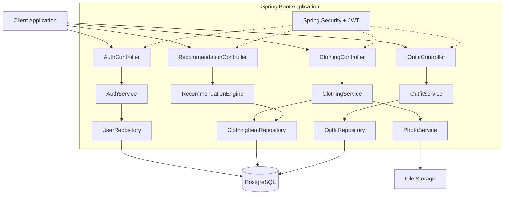
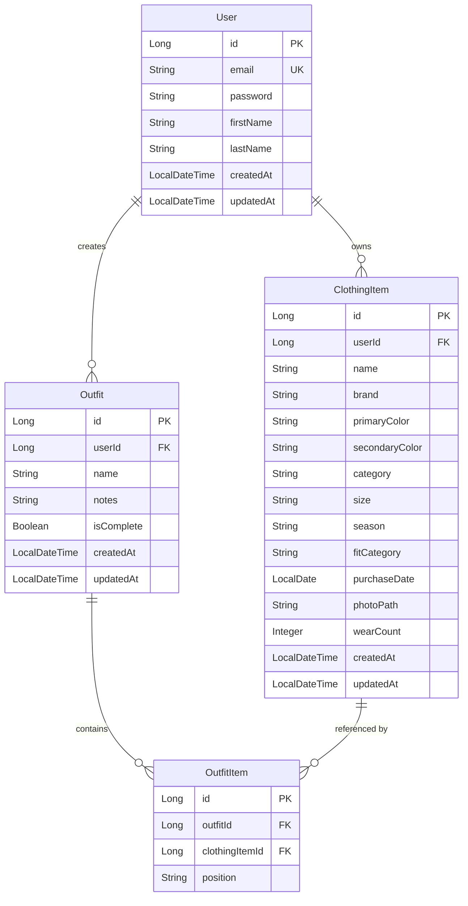
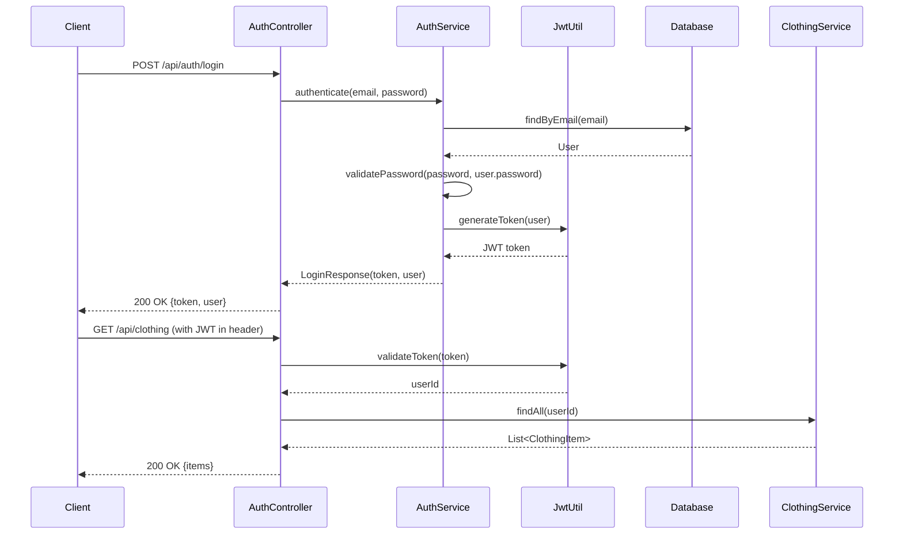

# Design Document: OutfitCreator Backend

## Overview

The OutfitCreator backend is a Spring Boot REST API application that provides digital wardrobe management and intelligent outfit recommendation services. The system follows a layered architecture pattern with clear separation between presentation (REST controllers), business logic (services), and data access (repositories) layers.

### Core Capabilities

- User authentication and profile management using Spring Security with JWT tokens
- Digital closet management with CRUD operations for clothing items
- Photo upload and storage with image optimization
- Intelligent outfit recommendation engine using color theory and fit analysis
- RESTful API with comprehensive OpenAPI documentation
- Relational data persistence with JPA/Hibernate

### Technology Stack

- **Framework**: Spring Boot 3.x
- **Security**: Spring Security with JWT authentication
- **Data Access**: Spring Data JPA with Hibernate
- **Database**: PostgreSQL (production), H2 (testing)
- **File Storage**: Local filesystem or cloud storage (S3-compatible)
- **Image Processing**: Thumbnailator library for resizing/optimization
- **API Documentation**: SpringDoc OpenAPI 3.0
- **Build Tool**: Maven
- **Testing**: JUnit 5, Mockito, Spring Boot Test


## Architecture

### Layered Architecture

The application follows a standard Spring Boot layered architecture:

```
┌─────────────────────────────────────────┐
│         REST Controllers                │
│  (Authentication, Clothing, Outfit,     │
│   Recommendation endpoints)             │
└─────────────────┬───────────────────────┘
                  │
┌─────────────────▼───────────────────────┐
│         Service Layer                   │
│  (Business logic, validation,           │
│   recommendation algorithms)            │
└─────────────────┬───────────────────────┘
                  │
┌─────────────────▼───────────────────────┐
│         Repository Layer                │
│  (JPA repositories, data access)        │
└─────────────────┬───────────────────────┘
                  │
┌─────────────────▼───────────────────────┐
│         Database (PostgreSQL)           │
└─────────────────────────────────────────┘
```

### Component Diagram



### Security Architecture

- JWT-based stateless authentication
- Password encryption using BCrypt
- Role-based access control (RBAC) with USER and ADMIN roles
- CORS configuration for frontend integration
- Request validation at controller layer
- User-scoped data access (users can only access their own closet)


## Components and Interfaces

### REST Controllers

#### AuthController

Handles user authentication and registration.

**Endpoints:**
- `POST /api/auth/register` - Register new user
- `POST /api/auth/login` - Authenticate and receive JWT token
- `GET /api/auth/profile` - Get current user profile (authenticated)
- `PUT /api/auth/profile` - Update user profile (authenticated)

#### ClothingItemController

Manages clothing items in the digital closet.

**Endpoints:**
- `POST /api/clothing` - Create new clothing item with photo upload
- `GET /api/clothing` - List all clothing items (with pagination and filters)
- `GET /api/clothing/{id}` - Get specific clothing item
- `PUT /api/clothing/{id}` - Update clothing item
- `DELETE /api/clothing/{id}` - Delete clothing item
- `POST /api/clothing/{id}/photo` - Upload/replace photo

**Query Parameters for GET /api/clothing:**
- `category` - Filter by category (top, bottom, footwear, etc.)
- `season` - Filter by season
- `color` - Filter by primary color
- `page` - Page number (default: 0)
- `size` - Items per page (default: 20)

#### OutfitController

Manages outfit creation and retrieval.

**Endpoints:**
- `POST /api/outfits` - Create new outfit
- `GET /api/outfits` - List all user outfits (with pagination)
- `GET /api/outfits/{id}` - Get specific outfit
- `PUT /api/outfits/{id}` - Update outfit (name, notes)
- `DELETE /api/outfits/{id}` - Delete outfit

#### RecommendationController

Provides outfit recommendations.

**Endpoints:**
- `GET /api/recommendations` - Get outfit recommendations

**Query Parameters:**
- `season` - Filter by season
- `occasion` - Filter by occasion (optional)
- `colorPreference` - Preferred color palette
- `limit` - Number of recommendations (default: 10, max: 20)

### Service Layer

#### AuthService

**Responsibilities:**
- User registration with password encryption
- Authentication and JWT token generation
- Profile management
- User validation

**Key Methods:**
```java
UserDTO register(RegisterRequest request)
LoginResponse login(LoginRequest request)
UserDTO getProfile(Long userId)
UserDTO updateProfile(Long userId, UpdateProfileRequest request)
```

#### ClothingItemService

**Responsibilities:**
- CRUD operations for clothing items
- Validation of clothing attributes
- Integration with PhotoService
- Audit logging for modifications
- Filtering and pagination

**Key Methods:**
```java
ClothingItemDTO create(Long userId, CreateClothingItemRequest request, MultipartFile photo)
ClothingItemDTO update(Long userId, Long itemId, UpdateClothingItemRequest request)
void delete(Long userId, Long itemId)
ClothingItemDTO getById(Long userId, Long itemId)
Page<ClothingItemDTO> findAll(Long userId, ClothingItemFilter filter, Pageable pageable)
```

#### OutfitService

**Responsibilities:**
- Outfit creation and management
- Validation of clothing item references
- Handling incomplete outfits (when items are deleted)
- Outfit compatibility score updates

**Key Methods:**
```java
OutfitDTO create(Long userId, CreateOutfitRequest request)
OutfitDTO update(Long userId, Long outfitId, UpdateOutfitRequest request)
void delete(Long userId, Long outfitId)
OutfitDTO getById(Long userId, Long outfitId)
Page<OutfitDTO> findAll(Long userId, Pageable pageable)
void handleClothingItemDeletion(Long itemId)
```

#### RecommendationEngine

**Responsibilities:**
- Analyze user's digital closet
- Generate outfit recommendations using color theory and fit analysis
- Calculate compatibility scores
- Balance wardrobe usage (prioritize less-worn items)
- Apply seasonal and weather filters

**Key Methods:**
```java
List<OutfitRecommendation> generateRecommendations(Long userId, RecommendationRequest request)
double calculateColorCompatibility(ClothingItem item1, ClothingItem item2)
double calculateFitCompatibility(ClothingItem top, ClothingItem bottom)
boolean isSeasonallyAppropriate(ClothingItem item, Season season)
List<ClothingItem> findCompatibleItems(ClothingItem anchor, List<ClothingItem> candidates)
```

#### PhotoService

**Responsibilities:**
- Photo upload and storage
- Image validation (format, size)
- Image optimization and resizing
- File deletion
- Generate unique filenames

**Key Methods:**
```java
String uploadPhoto(MultipartFile file, Long itemId)
void deletePhoto(String photoPath)
byte[] getPhoto(String photoPath)
BufferedImage resizeImage(BufferedImage original, int maxWidth, int maxHeight)
```


## Data Models

### Entity Relationship Diagram



### Domain Models

#### User Entity

```java
@Entity
@Table(name = "users")
public class User {
    @Id
    @GeneratedValue(strategy = GenerationType.IDENTITY)
    private Long id;
    
    @Column(unique = true, nullable = false)
    private String email;
    
    @Column(nullable = false)
    private String password; // BCrypt encrypted
    
    private String firstName;
    private String lastName;
    
    @OneToMany(mappedBy = "user", cascade = CascadeType.ALL)
    private List<ClothingItem> clothingItems;
    
    @OneToMany(mappedBy = "user", cascade = CascadeType.ALL)
    private List<Outfit> outfits;
    
    @Column(nullable = false, updatable = false)
    private LocalDateTime createdAt;
    
    @Column(nullable = false)
    private LocalDateTime updatedAt;
}
```

#### ClothingItem Entity

```java
@Entity
@Table(name = "clothing_items")
public class ClothingItem {
    @Id
    @GeneratedValue(strategy = GenerationType.IDENTITY)
    private Long id;
    
    @ManyToOne(fetch = FetchType.LAZY)
    @JoinColumn(name = "user_id", nullable = false)
    private User user;
    
    @Column(nullable = false)
    private String name;
    
    private String brand;
    
    @Column(nullable = false)
    private String primaryColor;
    
    private String secondaryColor;
    
    @Enumerated(EnumType.STRING)
    @Column(nullable = false)
    private ClothingCategory category; // TOP, BOTTOM, FOOTWEAR, OUTERWEAR, ACCESSORIES
    
    private String size;
    
    @Enumerated(EnumType.STRING)
    private Season season; // SPRING, SUMMER, AUTUMN, WINTER, ALL_SEASON
    
    @Enumerated(EnumType.STRING)
    private FitCategory fitCategory; // TIGHT, REGULAR, LOOSE, OVERSIZED
    
    private LocalDate purchaseDate;
    
    private String photoPath;
    
    @Column(nullable = false)
    private Integer wearCount = 0; // Track usage for balanced recommendations
    
    @Column(nullable = false, updatable = false)
    private LocalDateTime createdAt;
    
    @Column(nullable = false)
    private LocalDateTime updatedAt;
}
```

#### Outfit Entity

```java
@Entity
@Table(name = "outfits")
public class Outfit {
    @Id
    @GeneratedValue(strategy = GenerationType.IDENTITY)
    private Long id;
    
    @ManyToOne(fetch = FetchType.LAZY)
    @JoinColumn(name = "user_id", nullable = false)
    private User user;
    
    @Column(nullable = false)
    private String name;
    
    @Column(length = 1000)
    private String notes;
    
    @OneToMany(mappedBy = "outfit", cascade = CascadeType.ALL, orphanRemoval = true)
    private List<OutfitItem> items;
    
    @Column(nullable = false)
    private Boolean isComplete = true; // False if referenced items are deleted
    
    @Column(nullable = false, updatable = false)
    private LocalDateTime createdAt;
    
    @Column(nullable = false)
    private LocalDateTime updatedAt;
}
```

#### OutfitItem Entity

```java
@Entity
@Table(name = "outfit_items")
public class OutfitItem {
    @Id
    @GeneratedValue(strategy = GenerationType.IDENTITY)
    private Long id;
    
    @ManyToOne(fetch = FetchType.LAZY)
    @JoinColumn(name = "outfit_id", nullable = false)
    private Outfit outfit;
    
    @ManyToOne(fetch = FetchType.LAZY)
    @JoinColumn(name = "clothing_item_id")
    private ClothingItem clothingItem; // Nullable if item is deleted
    
    @Enumerated(EnumType.STRING)
    @Column(nullable = false)
    private ItemPosition position; // TOP, BOTTOM, FOOTWEAR, OUTERWEAR, ACCESSORY
}
```

### Enumerations

```java
public enum ClothingCategory {
    TOP, BOTTOM, FOOTWEAR, OUTERWEAR, ACCESSORIES
}

public enum Season {
    SPRING, SUMMER, AUTUMN, WINTER, ALL_SEASON
}

public enum FitCategory {
    TIGHT, REGULAR, LOOSE, OVERSIZED
}

public enum ItemPosition {
    TOP, BOTTOM, FOOTWEAR, OUTERWEAR, ACCESSORY
}

public enum ColorHarmonyType {
    COMPLEMENTARY, ANALOGOUS, TRIADIC, MONOCHROMATIC
}
```

### DTOs (Data Transfer Objects)

#### ClothingItemDTO

```java
public class ClothingItemDTO {
    private Long id;
    private String name;
    private String brand;
    private String primaryColor;
    private String secondaryColor;
    private ClothingCategory category;
    private String size;
    private Season season;
    private FitCategory fitCategory;
    private LocalDate purchaseDate;
    private String photoUrl;
    private Integer wearCount;
    private LocalDateTime createdAt;
    private LocalDateTime updatedAt;
}
```

#### OutfitDTO

```java
public class OutfitDTO {
    private Long id;
    private String name;
    private String notes;
    private List<OutfitItemDTO> items;
    private Boolean isComplete;
    private LocalDateTime createdAt;
    private LocalDateTime updatedAt;
}

public class OutfitItemDTO {
    private Long id;
    private ClothingItemDTO clothingItem;
    private ItemPosition position;
}
```

#### OutfitRecommendation

```java
public class OutfitRecommendation {
    private List<ClothingItemDTO> items;
    private double colorCompatibilityScore; // 0-100
    private double fitCompatibilityScore; // 0-100
    private double overallScore; // 0-100
    private String seasonalAppropriateness; // APPROPRIATE, WARNING, NOT_APPROPRIATE
    private Map<String, String> itemPositions; // itemId -> position
    private String explanation; // Human-readable explanation
}
```


### Recommendation Engine Algorithms

#### Color Compatibility Algorithm

The color compatibility algorithm uses color theory principles to determine which colors work well together.

**Color Wheel Representation:**

```java
public class ColorWheel {
    // Map color names to hue values (0-360 degrees)
    private static final Map<String, Integer> COLOR_HUES = Map.ofEntries(
        entry("red", 0),
        entry("orange", 30),
        entry("yellow", 60),
        entry("lime", 90),
        entry("green", 120),
        entry("cyan", 180),
        entry("blue", 240),
        entry("purple", 270),
        entry("magenta", 300),
        entry("pink", 330),
        entry("white", -1),  // Neutral
        entry("black", -1),  // Neutral
        entry("gray", -1),   // Neutral
        entry("beige", -1),  // Neutral
        entry("brown", 25)
    );
    
    public static int getHue(String color) {
        return COLOR_HUES.getOrDefault(color.toLowerCase(), -1);
    }
    
    public static boolean isNeutral(String color) {
        return getHue(color) == -1;
    }
}
```

**Harmony Calculation:**

```java
public double calculateColorCompatibility(ClothingItem item1, ClothingItem item2) {
    String color1 = item1.getPrimaryColor();
    String color2 = item2.getPrimaryColor();
    
    // Neutrals always compatible
    if (ColorWheel.isNeutral(color1) || ColorWheel.isNeutral(color2)) {
        return 95.0;
    }
    
    int hue1 = ColorWheel.getHue(color1);
    int hue2 = ColorWheel.getHue(color2);
    
    int hueDifference = Math.abs(hue1 - hue2);
    if (hueDifference > 180) {
        hueDifference = 360 - hueDifference;
    }
    
    // Determine harmony type and score
    if (hueDifference <= 30) {
        // Monochromatic or analogous (0-30 degrees)
        return 90.0;
    } else if (hueDifference >= 150 && hueDifference <= 210) {
        // Complementary (180 degrees ± 30)
        return 85.0;
    } else if (hueDifference >= 110 && hueDifference <= 130) {
        // Triadic (120 degrees ± 10)
        return 80.0;
    } else if (hueDifference >= 50 && hueDifference <= 70) {
        // Analogous extended (60 degrees ± 10)
        return 75.0;
    } else {
        // Less harmonious combinations
        return 50.0;
    }
}
```

#### Fit Compatibility Algorithm

The fit compatibility algorithm ensures balanced outfit proportions.

```java
public double calculateFitCompatibility(ClothingItem top, ClothingItem bottom) {
    FitCategory topFit = top.getFitCategory();
    FitCategory bottomFit = bottom.getFitCategory();
    
    // Compatibility matrix
    if (topFit == FitCategory.TIGHT && bottomFit == FitCategory.TIGHT) {
        return 30.0; // Avoid tight-tight
    } else if (topFit == FitCategory.LOOSE && bottomFit == FitCategory.LOOSE) {
        return 40.0; // Avoid loose-loose
    } else if (topFit == FitCategory.OVERSIZED && bottomFit == FitCategory.OVERSIZED) {
        return 20.0; // Avoid oversized-oversized
    } else if ((topFit == FitCategory.TIGHT && bottomFit == FitCategory.LOOSE) ||
               (topFit == FitCategory.LOOSE && bottomFit == FitCategory.TIGHT)) {
        return 95.0; // Excellent balance
    } else if ((topFit == FitCategory.TIGHT && bottomFit == FitCategory.REGULAR) ||
               (topFit == FitCategory.REGULAR && bottomFit == FitCategory.TIGHT)) {
        return 90.0; // Good balance
    } else if ((topFit == FitCategory.LOOSE && bottomFit == FitCategory.REGULAR) ||
               (topFit == FitCategory.REGULAR && bottomFit == FitCategory.LOOSE)) {
        return 85.0; // Good balance
    } else if (topFit == FitCategory.REGULAR && bottomFit == FitCategory.REGULAR) {
        return 80.0; // Safe but less interesting
    } else {
        return 70.0; // Other combinations
    }
}
```

#### Seasonal Appropriateness

```java
public boolean isSeasonallyAppropriate(ClothingItem item, Season currentSeason) {
    Season itemSeason = item.getSeason();
    
    // All-season items are always appropriate
    if (itemSeason == Season.ALL_SEASON) {
        return true;
    }
    
    // Direct match
    if (itemSeason == currentSeason) {
        return true;
    }
    
    // Adjacent seasons are acceptable
    return areAdjacentSeasons(itemSeason, currentSeason);
}

private boolean areAdjacentSeasons(Season s1, Season s2) {
    List<Season> seasonOrder = List.of(
        Season.WINTER, Season.SPRING, Season.SUMMER, Season.AUTUMN
    );
    
    int idx1 = seasonOrder.indexOf(s1);
    int idx2 = seasonOrder.indexOf(s2);
    
    int diff = Math.abs(idx1 - idx2);
    return diff == 1 || diff == 3; // Adjacent or wrap-around
}
```

#### Recommendation Generation Algorithm

```java
public List<OutfitRecommendation> generateRecommendations(
        Long userId, 
        RecommendationRequest request) {
    
    // 1. Fetch user's clothing items
    List<ClothingItem> allItems = clothingItemRepository.findByUserId(userId);
    
    // 2. Apply filters (season, color preferences)
    List<ClothingItem> filteredItems = applyFilters(allItems, request);
    
    // 3. Group by category
    Map<ClothingCategory, List<ClothingItem>> itemsByCategory = 
        filteredItems.stream()
            .collect(Collectors.groupingBy(ClothingItem::getCategory));
    
    // 4. Generate outfit combinations
    List<OutfitRecommendation> recommendations = new ArrayList<>();
    
    List<ClothingItem> tops = itemsByCategory.getOrDefault(ClothingCategory.TOP, List.of());
    List<ClothingItem> bottoms = itemsByCategory.getOrDefault(ClothingCategory.BOTTOM, List.of());
    List<ClothingItem> footwear = itemsByCategory.getOrDefault(ClothingCategory.FOOTWEAR, List.of());
    List<ClothingItem> outerwear = itemsByCategory.getOrDefault(ClothingCategory.OUTERWEAR, List.of());
    
    // 5. Generate combinations (prioritize less-worn items)
    tops = sortByWearCount(tops);
    bottoms = sortByWearCount(bottoms);
    
    for (ClothingItem top : tops) {
        for (ClothingItem bottom : bottoms) {
            // Calculate compatibility
            double colorScore = calculateColorCompatibility(top, bottom);
            double fitScore = calculateFitCompatibility(top, bottom);
            
            // Skip low-scoring combinations
            if (colorScore < 50.0 || fitScore < 50.0) {
                continue;
            }
            
            // Find compatible footwear
            ClothingItem shoe = findBestFootwear(footwear, top, bottom);
            
            // Optionally add outerwear
            ClothingItem jacket = findBestOuterwear(outerwear, top, bottom);
            
            // Create recommendation
            OutfitRecommendation rec = buildRecommendation(
                top, bottom, shoe, jacket, colorScore, fitScore, request.getSeason()
            );
            
            recommendations.add(rec);
            
            // Limit recommendations
            if (recommendations.size() >= request.getLimit()) {
                break;
            }
        }
        
        if (recommendations.size() >= request.getLimit()) {
            break;
        }
    }
    
    // 6. Sort by overall score
    recommendations.sort(Comparator.comparingDouble(
        OutfitRecommendation::getOverallScore).reversed()
    );
    
    // 7. Return top N recommendations
    return recommendations.stream()
        .limit(Math.min(request.getLimit(), 20))
        .collect(Collectors.toList());
}

private List<ClothingItem> sortByWearCount(List<ClothingItem> items) {
    return items.stream()
        .sorted(Comparator.comparingInt(ClothingItem::getWearCount))
        .collect(Collectors.toList());
}

private OutfitRecommendation buildRecommendation(
        ClothingItem top, ClothingItem bottom, ClothingItem shoe, 
        ClothingItem jacket, double colorScore, double fitScore, Season season) {
    
    OutfitRecommendation rec = new OutfitRecommendation();
    
    List<ClothingItemDTO> items = new ArrayList<>();
    items.add(toDTO(top));
    items.add(toDTO(bottom));
    if (shoe != null) items.add(toDTO(shoe));
    if (jacket != null) items.add(toDTO(jacket));
    
    rec.setItems(items);
    rec.setColorCompatibilityScore(colorScore);
    rec.setFitCompatibilityScore(fitScore);
    rec.setOverallScore((colorScore + fitScore) / 2.0);
    
    // Check seasonal appropriateness
    boolean allAppropriate = items.stream()
        .allMatch(item -> isSeasonallyAppropriate(item, season));
    
    rec.setSeasonalAppropriateness(
        allAppropriate ? "APPROPRIATE" : "WARNING"
    );
    
    // Build explanation
    rec.setExplanation(generateExplanation(colorScore, fitScore, allAppropriate));
    
    return rec;
}
```


### Photo Storage and Management

#### Storage Strategy

**Local Filesystem Approach (Development/Small Scale):**

```
storage/
├── photos/
│   ├── user_{userId}/
│   │   ├── item_{itemId}_{timestamp}.jpg
│   │   ├── item_{itemId}_{timestamp}_thumb.jpg
```

**Cloud Storage Approach (Production/Scale):**
- Use AWS S3 or compatible object storage
- Organize by user ID for access control
- Generate pre-signed URLs for secure access
- Implement CDN for faster delivery

#### Photo Processing Pipeline

```java
@Service
public class PhotoService {
    
    @Value("${storage.base-path}")
    private String basePath;
    
    @Value("${storage.max-file-size}")
    private long maxFileSize = 5 * 1024 * 1024; // 5MB
    
    @Value("${storage.max-resolution}")
    private int maxResolution = 1920;
    
    private static final Set<String> ALLOWED_TYPES = 
        Set.of("image/jpeg", "image/png", "image/gif");
    
    public String uploadPhoto(MultipartFile file, Long itemId) {
        // 1. Validate file type
        if (!ALLOWED_TYPES.contains(file.getContentType())) {
            throw new InvalidFileTypeException("Only JPEG, PNG, and GIF are supported");
        }
        
        // 2. Validate file size
        if (file.getSize() > maxFileSize) {
            throw new FileSizeExceededException("File size exceeds 5MB limit");
        }
        
        // 3. Generate unique filename
        String timestamp = String.valueOf(System.currentTimeMillis());
        String extension = getExtension(file.getOriginalFilename());
        String filename = String.format("item_%d_%s.%s", itemId, timestamp, extension);
        
        // 4. Read and process image
        BufferedImage image = ImageIO.read(file.getInputStream());
        
        // 5. Resize if necessary
        if (image.getWidth() > maxResolution || image.getHeight() > maxResolution) {
            image = resizeImage(image, maxResolution, maxResolution);
        }
        
        // 6. Save to storage
        Path photoPath = Paths.get(basePath, "photos", filename);
        Files.createDirectories(photoPath.getParent());
        ImageIO.write(image, extension, photoPath.toFile());
        
        // 7. Generate thumbnail
        BufferedImage thumbnail = resizeImage(image, 300, 300);
        Path thumbPath = Paths.get(basePath, "photos", 
            String.format("item_%d_%s_thumb.%s", itemId, timestamp, extension));
        ImageIO.write(thumbnail, extension, thumbPath.toFile());
        
        return photoPath.toString();
    }
    
    public void deletePhoto(String photoPath) {
        try {
            Files.deleteIfExists(Paths.get(photoPath));
            
            // Delete thumbnail
            String thumbPath = photoPath.replace(".", "_thumb.");
            Files.deleteIfExists(Paths.get(thumbPath));
        } catch (IOException e) {
            log.error("Failed to delete photo: {}", photoPath, e);
        }
    }
    
    public byte[] getPhoto(String photoPath) throws IOException {
        return Files.readAllBytes(Paths.get(photoPath));
    }
    
    private BufferedImage resizeImage(BufferedImage original, int maxWidth, int maxHeight) {
        int width = original.getWidth();
        int height = original.getHeight();
        
        // Calculate scaling factor
        double scale = Math.min(
            (double) maxWidth / width,
            (double) maxHeight / height
        );
        
        if (scale >= 1.0) {
            return original; // No resize needed
        }
        
        int newWidth = (int) (width * scale);
        int newHeight = (int) (height * scale);
        
        // Use Thumbnailator for high-quality resizing
        return Thumbnails.of(original)
            .size(newWidth, newHeight)
            .asBufferedImage();
    }
    
    private String getExtension(String filename) {
        return filename.substring(filename.lastIndexOf('.') + 1).toLowerCase();
    }
}
```

#### Photo URL Generation

```java
@Service
public class PhotoUrlService {
    
    @Value("${app.base-url}")
    private String baseUrl;
    
    public String generatePhotoUrl(String photoPath) {
        if (photoPath == null) {
            return null;
        }
        
        // For local storage
        String filename = Paths.get(photoPath).getFileName().toString();
        return String.format("%s/api/photos/%s", baseUrl, filename);
    }
    
    public String generateThumbnailUrl(String photoPath) {
        if (photoPath == null) {
            return null;
        }
        
        String filename = Paths.get(photoPath).getFileName().toString();
        String thumbFilename = filename.replace(".", "_thumb.");
        return String.format("%s/api/photos/%s", baseUrl, thumbFilename);
    }
}
```


### Database Schema Design

#### Schema DDL

```sql
-- Users table
CREATE TABLE users (
    id BIGSERIAL PRIMARY KEY,
    email VARCHAR(255) UNIQUE NOT NULL,
    password VARCHAR(255) NOT NULL,
    first_name VARCHAR(100),
    last_name VARCHAR(100),
    created_at TIMESTAMP NOT NULL DEFAULT CURRENT_TIMESTAMP,
    updated_at TIMESTAMP NOT NULL DEFAULT CURRENT_TIMESTAMP
);

CREATE INDEX idx_users_email ON users(email);

-- Clothing items table
CREATE TABLE clothing_items (
    id BIGSERIAL PRIMARY KEY,
    user_id BIGINT NOT NULL,
    name VARCHAR(255) NOT NULL,
    brand VARCHAR(100),
    primary_color VARCHAR(50) NOT NULL,
    secondary_color VARCHAR(50),
    category VARCHAR(50) NOT NULL,
    size VARCHAR(20),
    season VARCHAR(20),
    fit_category VARCHAR(20),
    purchase_date DATE,
    photo_path VARCHAR(500),
    wear_count INTEGER NOT NULL DEFAULT 0,
    created_at TIMESTAMP NOT NULL DEFAULT CURRENT_TIMESTAMP,
    updated_at TIMESTAMP NOT NULL DEFAULT CURRENT_TIMESTAMP,
    FOREIGN KEY (user_id) REFERENCES users(id) ON DELETE CASCADE
);

CREATE INDEX idx_clothing_items_user_id ON clothing_items(user_id);
CREATE INDEX idx_clothing_items_category ON clothing_items(category);
CREATE INDEX idx_clothing_items_season ON clothing_items(season);
CREATE INDEX idx_clothing_items_primary_color ON clothing_items(primary_color);

-- Outfits table
CREATE TABLE outfits (
    id BIGSERIAL PRIMARY KEY,
    user_id BIGINT NOT NULL,
    name VARCHAR(255) NOT NULL,
    notes TEXT,
    is_complete BOOLEAN NOT NULL DEFAULT TRUE,
    created_at TIMESTAMP NOT NULL DEFAULT CURRENT_TIMESTAMP,
    updated_at TIMESTAMP NOT NULL DEFAULT CURRENT_TIMESTAMP,
    FOREIGN KEY (user_id) REFERENCES users(id) ON DELETE CASCADE
);

CREATE INDEX idx_outfits_user_id ON outfits(user_id);

-- Outfit items table (junction table)
CREATE TABLE outfit_items (
    id BIGSERIAL PRIMARY KEY,
    outfit_id BIGINT NOT NULL,
    clothing_item_id BIGINT,
    position VARCHAR(50) NOT NULL,
    FOREIGN KEY (outfit_id) REFERENCES outfits(id) ON DELETE CASCADE,
    FOREIGN KEY (clothing_item_id) REFERENCES clothing_items(id) ON DELETE SET NULL
);

CREATE INDEX idx_outfit_items_outfit_id ON outfit_items(outfit_id);
CREATE INDEX idx_outfit_items_clothing_item_id ON outfit_items(clothing_item_id);

-- Audit log table (for tracking modifications)
CREATE TABLE audit_log (
    id BIGSERIAL PRIMARY KEY,
    user_id BIGINT NOT NULL,
    entity_type VARCHAR(50) NOT NULL,
    entity_id BIGINT NOT NULL,
    action VARCHAR(20) NOT NULL,
    old_value TEXT,
    new_value TEXT,
    created_at TIMESTAMP NOT NULL DEFAULT CURRENT_TIMESTAMP,
    FOREIGN KEY (user_id) REFERENCES users(id) ON DELETE CASCADE
);

CREATE INDEX idx_audit_log_user_id ON audit_log(user_id);
CREATE INDEX idx_audit_log_entity ON audit_log(entity_type, entity_id);
CREATE INDEX idx_audit_log_created_at ON audit_log(created_at);
```

#### Database Constraints and Rules

1. **Referential Integrity:**
   - User deletion cascades to clothing items and outfits
   - Clothing item deletion sets outfit_items.clothing_item_id to NULL (soft reference)
   - Outfit deletion cascades to outfit items

2. **Indexes:**
   - Primary keys automatically indexed
   - Foreign keys indexed for join performance
   - Filter columns (category, season, color) indexed for query performance
   - Email indexed for authentication lookups

3. **Data Validation:**
   - Email uniqueness enforced at database level
   - NOT NULL constraints on required fields
   - Default values for timestamps and wear_count


### Security and Authentication

#### JWT Authentication Flow



#### Security Configuration

```java
@Configuration
@EnableWebSecurity
public class SecurityConfig {
    
    @Autowired
    private JwtAuthenticationFilter jwtAuthFilter;
    
    @Bean
    public SecurityFilterChain securityFilterChain(HttpSecurity http) throws Exception {
        http
            .csrf().disable()
            .cors().and()
            .authorizeHttpRequests()
                .requestMatchers("/api/auth/**").permitAll()
                .requestMatchers("/api/docs/**", "/swagger-ui/**").permitAll()
                .requestMatchers("/api/**").authenticated()
                .anyRequest().authenticated()
            .and()
            .sessionManagement()
                .sessionCreationPolicy(SessionCreationPolicy.STATELESS)
            .and()
            .addFilterBefore(jwtAuthFilter, UsernamePasswordAuthenticationFilter.class);
        
        return http.build();
    }
    
    @Bean
    public PasswordEncoder passwordEncoder() {
        return new BCryptPasswordEncoder(12);
    }
    
    @Bean
    public AuthenticationManager authenticationManager(
            AuthenticationConfiguration config) throws Exception {
        return config.getAuthenticationManager();
    }
}
```

#### JWT Utility

```java
@Component
public class JwtUtil {
    
    @Value("${jwt.secret}")
    private String secret;
    
    @Value("${jwt.expiration}")
    private long expiration = 86400000; // 24 hours
    
    public String generateToken(User user) {
        Map<String, Object> claims = new HashMap<>();
        claims.put("userId", user.getId());
        claims.put("email", user.getEmail());
        
        return Jwts.builder()
            .setClaims(claims)
            .setSubject(user.getEmail())
            .setIssuedAt(new Date())
            .setExpiration(new Date(System.currentTimeMillis() + expiration))
            .signWith(SignatureAlgorithm.HS512, secret)
            .compact();
    }
    
    public Long extractUserId(String token) {
        Claims claims = extractAllClaims(token);
        return claims.get("userId", Long.class);
    }
    
    public String extractEmail(String token) {
        return extractAllClaims(token).getSubject();
    }
    
    public boolean validateToken(String token) {
        try {
            Jwts.parser().setSigningKey(secret).parseClaimsJws(token);
            return !isTokenExpired(token);
        } catch (JwtException | IllegalArgumentException e) {
            return false;
        }
    }
    
    private Claims extractAllClaims(String token) {
        return Jwts.parser()
            .setSigningKey(secret)
            .parseClaimsJws(token)
            .getBody();
    }
    
    private boolean isTokenExpired(String token) {
        return extractAllClaims(token).getExpiration().before(new Date());
    }
}
```

#### JWT Authentication Filter

```java
@Component
public class JwtAuthenticationFilter extends OncePerRequestFilter {
    
    @Autowired
    private JwtUtil jwtUtil;
    
    @Override
    protected void doFilterInternal(
            HttpServletRequest request,
            HttpServletResponse response,
            FilterChain filterChain) throws ServletException, IOException {
        
        String authHeader = request.getHeader("Authorization");
        
        if (authHeader != null && authHeader.startsWith("Bearer ")) {
            String token = authHeader.substring(7);
            
            if (jwtUtil.validateToken(token)) {
                Long userId = jwtUtil.extractUserId(token);
                String email = jwtUtil.extractEmail(token);
                
                UsernamePasswordAuthenticationToken authentication = 
                    new UsernamePasswordAuthenticationToken(
                        userId, null, Collections.emptyList()
                    );
                
                SecurityContextHolder.getContext().setAuthentication(authentication);
            }
        }
        
        filterChain.doFilter(request, response);
    }
}
```

#### User-Scoped Data Access

All service methods enforce user-scoped access:

```java
@Service
public class ClothingItemService {
    
    public ClothingItemDTO getById(Long userId, Long itemId) {
        ClothingItem item = clothingItemRepository.findById(itemId)
            .orElseThrow(() -> new ResourceNotFoundException("Item not found"));
        
        // Verify ownership
        if (!item.getUser().getId().equals(userId)) {
            throw new ForbiddenException("Access denied");
        }
        
        return toDTO(item);
    }
    
    public Page<ClothingItemDTO> findAll(Long userId, Pageable pageable) {
        // Only return items belonging to the user
        return clothingItemRepository.findByUserId(userId, pageable)
            .map(this::toDTO);
    }
}
```


## Correctness Properties

A property is a characteristic or behavior that should hold true across all valid executions of a system—essentially, a formal statement about what the system should do. Properties serve as the bridge between human-readable specifications and machine-verifiable correctness guarantees.

### Property Reflection

After analyzing all acceptance criteria, I identified several redundancies:
- Requirements 3.2, 13.1, 13.2, 13.3 are covered by more specific round-trip properties
- Requirements 7.2, 7.3, 7.4 are covered by more specific requirements 8.x, 9.x, 10.x
- Requirements 16.1, 16.2 are covered by specific validation tests
- Requirements 17.2, 18.1, 18.2, 18.4 duplicate other properties

The following properties represent the unique, testable behaviors of the system:

### Authentication and User Management Properties

#### Property 1: User Registration Round-Trip

For any valid email and password combination, registering a new user and then logging in with those credentials should return a valid JWT token that can be used to access protected resources.

**Validates: Requirements 1.1, 1.2**

#### Property 2: Digital Closet Isolation

For any two different users, the clothing items in one user's digital closet should never appear in the other user's closet, regardless of the operations performed.

**Validates: Requirements 1.3**

#### Property 3: Profile Update Round-Trip

For any authenticated user and any valid profile updates, updating the profile and then retrieving it should return the updated values.

**Validates: Requirements 1.4**

#### Property 4: Authentication Failure Returns 401

For any invalid credentials (wrong email or wrong password), attempting to log in should return a 401 Unauthorized status.

**Validates: Requirements 1.5**

### Clothing Item Management Properties

#### Property 5: Clothing Item Creation Round-Trip

For any valid clothing item with all required attributes (name, primaryColor, category), creating the item and then retrieving it should return an item with all the same attribute values.

**Validates: Requirements 3.1, 3.3**

#### Property 6: Photo Upload Round-Trip

For any valid image file (JPEG, PNG, or GIF) under 5MB, uploading it with a clothing item and then retrieving the item should return a valid photo URL that can be used to access the image.

**Validates: Requirements 2.1, 2.2**

#### Property 7: Invalid File Type Rejection

For any file that is not JPEG, PNG, or GIF, attempting to upload it as a clothing item photo should return a 400 Bad Request status.

**Validates: Requirements 2.4**

#### Property 8: Oversized File Rejection

For any file larger than 5MB, attempting to upload it as a clothing item photo should return a 413 Payload Too Large status.

**Validates: Requirements 2.5**

#### Property 9: Category Validation

For any clothing item creation or update request, if the category is not one of the predefined values (TOP, BOTTOM, FOOTWEAR, OUTERWEAR, ACCESSORIES), the system should return a 400 Bad Request with validation error details.

**Validates: Requirements 3.4, 3.5**

#### Property 10: Clothing Item Update Preserves ID

For any clothing item and any valid attribute updates, updating the item should preserve the original ID while changing the specified attributes.

**Validates: Requirements 4.1**

#### Property 11: Clothing Item Deletion

For any clothing item in a user's closet, deleting the item and then attempting to retrieve it should return a 404 Not Found status.

**Validates: Requirements 4.2, 4.4**

#### Property 12: Audit Log Creation

For any clothing item modification (create, update, delete), an audit log entry should be created with the user ID, entity type, entity ID, action, and timestamp.

**Validates: Requirements 4.5**

### Filtering and Pagination Properties

#### Property 13: Category Filter Correctness

For any category filter value, all clothing items returned by the filter should have that category, and no items with different categories should be returned.

**Validates: Requirements 5.1**

#### Property 14: Season Filter Correctness

For any season filter value, all clothing items returned by the filter should have that season or ALL_SEASON, and no items with incompatible seasons should be returned.

**Validates: Requirements 5.2**

#### Property 15: Color Filter Correctness

For any primary color filter value, all clothing items returned should have that primary color.

**Validates: Requirements 5.3**

#### Property 16: Pagination Bounds

For any pagination request, the number of items returned should not exceed the specified page size (default 20), and requesting different pages should return non-overlapping sets of items.

**Validates: Requirements 5.5**

### Outfit Management Properties

#### Property 17: Outfit Creation Round-Trip

For any valid outfit with selected clothing items and their positions, creating the outfit and then retrieving it should return an outfit with the same items in the same positions.

**Validates: Requirements 6.1, 6.2**

#### Property 18: Outfit ID and Timestamp Generation

For any created outfit, the system should generate a unique ID and a timestamp, and no two outfits should have the same ID.

**Validates: Requirements 6.3**

#### Property 19: Outfit Update Round-Trip

For any outfit and any valid name or notes update, updating the outfit and then retrieving it should return the updated values.

**Validates: Requirements 6.4**

#### Property 20: Outfit Incompleteness on Item Deletion

For any outfit containing a clothing item, if that clothing item is deleted, the outfit should be marked as incomplete (isComplete = false).

**Validates: Requirements 6.5**

### Recommendation Engine Properties

#### Property 21: Wear Count Balancing

For any user's digital closet with items having different wear counts, generated recommendations should prioritize items with lower wear counts over items with higher wear counts.

**Validates: Requirements 7.5**

#### Property 22: Primary Color Matching Priority

For any clothing item with both primary and secondary colors, the color compatibility score should be calculated using only the primary color, and changing the secondary color should not affect the score.

**Validates: Requirements 8.2**

#### Property 23: Color Harmony Recognition

For any two clothing items, the color compatibility score should reflect recognized color harmony types: complementary colors (180° apart) should score 85+, analogous colors (30° apart) should score 90+, and neutral colors should score 95+.

**Validates: Requirements 8.3**

#### Property 24: Color Compatibility Score Range

For any color compatibility calculation between two clothing items, the score should be within the range of 0-100 inclusive.

**Validates: Requirements 8.5, 18.3**

#### Property 25: Tight-Loose Fit Pairing

For any clothing item with TIGHT fit category, recommended complementary items should have LOOSE or REGULAR fit categories, never TIGHT.

**Validates: Requirements 9.2**

#### Property 26: Loose-Tight Fit Pairing

For any clothing item with LOOSE fit category, recommended complementary items should have TIGHT or REGULAR fit categories, never LOOSE.

**Validates: Requirements 9.3**

#### Property 27: Invalid Fit Combination Exclusion

For any outfit recommendation containing both a top and bottom, the combination should never be tight-tight or loose-loose.

**Validates: Requirements 9.4**

#### Property 28: Fit Compatibility Score Range

For any fit compatibility calculation between two clothing items, the score should be within the range of 0-100 inclusive.

**Validates: Requirements 9.5**

#### Property 29: Seasonal Appropriateness Filtering

For any recommendation request with a specified season, the system should prioritize clothing items that match that season or are marked as ALL_SEASON.

**Validates: Requirements 10.3**

#### Property 30: Recommendation Response Size Bounds

For any recommendation request, the number of recommendations returned should be between 0 and the specified limit (maximum 20).

**Validates: Requirements 11.3**

#### Property 31: Recommendation Response Structure

For any outfit recommendation returned, it should include all required fields: items list, colorCompatibilityScore, fitCompatibilityScore, overallScore, and seasonalAppropriateness.

**Validates: Requirements 11.4**

#### Property 32: Recommendation Filter Compliance

For any recommendation request with query parameters (season, color preference), all returned recommendations should comply with the specified filters.

**Validates: Requirements 11.2**

### Photo Storage Properties

#### Property 33: Unique Filename Generation

For any two photo uploads, even for the same clothing item, the generated filenames should be unique (using item ID and timestamp).

**Validates: Requirements 12.1**

#### Property 34: Image Resolution Constraint

For any uploaded image, the stored image should have a maximum resolution of 1920x1080, with larger images being resized proportionally.

**Validates: Requirements 12.2, 12.4**

#### Property 35: Photo Replacement Cleanup

For any clothing item with an existing photo, uploading a new photo should delete the old photo file from storage.

**Validates: Requirements 12.3**

### Validation and Error Handling Properties

#### Property 36: Required Field Validation

For any API request missing a required field, the system should return a 400 Bad Request with an error message specifying which field is required.

**Validates: Requirements 16.3**

#### Property 37: Error Message Safety

For any error response, the error message should not contain sensitive system information such as database connection strings, internal file paths, or stack traces.

**Validates: Requirements 16.5**

### Recommendation Consistency Properties

#### Property 38: Recommendation Idempotence

For any user's digital closet and recommendation parameters, generating recommendations twice without modifying the closet should produce identical results.

**Validates: Requirements 17.1**

#### Property 39: Recommended Items Existence

For any outfit recommendation, all clothing items included in the recommendation should exist in the user's digital closet at the time of recommendation generation.

**Validates: Requirements 17.3**

#### Property 40: Outfit Score Recalculation

For any stored outfit, if a clothing item in the outfit is modified (e.g., color or fit category changed), retrieving the outfit should reflect updated compatibility scores.

**Validates: Requirements 17.4**

#### Property 41: Recommendation Storage Round-Trip

For any generated outfit recommendation, saving it as an outfit and then retrieving the outfit should produce an equivalent set of items with the same positions.

**Validates: Requirements 17.5**

#### Property 42: Graceful Handling of Invalid Data

For any recommendation generation request, if some clothing items have missing or invalid attribute data (e.g., null fit category), the system should still generate recommendations using the valid items without throwing an exception.

**Validates: Requirements 18.5**


## Error Handling

### Exception Hierarchy

```java
// Base exception
public class OutfitCreatorException extends RuntimeException {
    private final String errorCode;
    private final HttpStatus httpStatus;
    
    public OutfitCreatorException(String message, String errorCode, HttpStatus httpStatus) {
        super(message);
        this.errorCode = errorCode;
        this.httpStatus = httpStatus;
    }
}

// Specific exceptions
public class ResourceNotFoundException extends OutfitCreatorException {
    public ResourceNotFoundException(String message) {
        super(message, "RESOURCE_NOT_FOUND", HttpStatus.NOT_FOUND);
    }
}

public class ValidationException extends OutfitCreatorException {
    private final Map<String, String> fieldErrors;
    
    public ValidationException(String message, Map<String, String> fieldErrors) {
        super(message, "VALIDATION_ERROR", HttpStatus.BAD_REQUEST);
        this.fieldErrors = fieldErrors;
    }
}

public class UnauthorizedException extends OutfitCreatorException {
    public UnauthorizedException(String message) {
        super(message, "UNAUTHORIZED", HttpStatus.UNAUTHORIZED);
    }
}

public class ForbiddenException extends OutfitCreatorException {
    public ForbiddenException(String message) {
        super(message, "FORBIDDEN", HttpStatus.FORBIDDEN);
    }
}

public class InvalidFileTypeException extends OutfitCreatorException {
    public InvalidFileTypeException(String message) {
        super(message, "INVALID_FILE_TYPE", HttpStatus.BAD_REQUEST);
    }
}

public class FileSizeExceededException extends OutfitCreatorException {
    public FileSizeExceededException(String message) {
        super(message, "FILE_SIZE_EXCEEDED", HttpStatus.PAYLOAD_TOO_LARGE);
    }
}

public class StorageException extends OutfitCreatorException {
    public StorageException(String message) {
        super(message, "STORAGE_ERROR", HttpStatus.INTERNAL_SERVER_ERROR);
    }
}
```

### Global Exception Handler

```java
@RestControllerAdvice
public class GlobalExceptionHandler {
    
    private static final Logger log = LoggerFactory.getLogger(GlobalExceptionHandler.class);
    
    @ExceptionHandler(OutfitCreatorException.class)
    public ResponseEntity<ErrorResponse> handleOutfitCreatorException(
            OutfitCreatorException ex) {
        
        log.error("Application error: {}", ex.getMessage(), ex);
        
        ErrorResponse response = ErrorResponse.builder()
            .timestamp(LocalDateTime.now())
            .status(ex.getHttpStatus().value())
            .error(ex.getHttpStatus().getReasonPhrase())
            .message(ex.getMessage())
            .errorCode(ex.getErrorCode())
            .build();
        
        if (ex instanceof ValidationException) {
            ValidationException validationEx = (ValidationException) ex;
            response.setFieldErrors(validationEx.getFieldErrors());
        }
        
        return ResponseEntity.status(ex.getHttpStatus()).body(response);
    }
    
    @ExceptionHandler(MethodArgumentNotValidException.class)
    public ResponseEntity<ErrorResponse> handleValidationException(
            MethodArgumentNotValidException ex) {
        
        Map<String, String> fieldErrors = new HashMap<>();
        ex.getBindingResult().getFieldErrors().forEach(error -> 
            fieldErrors.put(error.getField(), error.getDefaultMessage())
        );
        
        ErrorResponse response = ErrorResponse.builder()
            .timestamp(LocalDateTime.now())
            .status(HttpStatus.BAD_REQUEST.value())
            .error("Validation Failed")
            .message("Invalid request parameters")
            .errorCode("VALIDATION_ERROR")
            .fieldErrors(fieldErrors)
            .build();
        
        return ResponseEntity.badRequest().body(response);
    }
    
    @ExceptionHandler(Exception.class)
    public ResponseEntity<ErrorResponse> handleGenericException(Exception ex) {
        
        log.error("Unexpected error", ex);
        
        // Don't expose internal details
        ErrorResponse response = ErrorResponse.builder()
            .timestamp(LocalDateTime.now())
            .status(HttpStatus.INTERNAL_SERVER_ERROR.value())
            .error("Internal Server Error")
            .message("An unexpected error occurred")
            .errorCode("INTERNAL_ERROR")
            .build();
        
        return ResponseEntity.status(HttpStatus.INTERNAL_SERVER_ERROR).body(response);
    }
}
```

### Error Response Format

```java
@Data
@Builder
public class ErrorResponse {
    private LocalDateTime timestamp;
    private int status;
    private String error;
    private String message;
    private String errorCode;
    private Map<String, String> fieldErrors;
    private String path;
}
```

### HTTP Status Code Mapping

| Error Condition | HTTP Status | Error Code |
|----------------|-------------|------------|
| Resource not found | 404 Not Found | RESOURCE_NOT_FOUND |
| Invalid credentials | 401 Unauthorized | UNAUTHORIZED |
| Access denied | 403 Forbidden | FORBIDDEN |
| Validation failure | 400 Bad Request | VALIDATION_ERROR |
| Invalid file type | 400 Bad Request | INVALID_FILE_TYPE |
| File size exceeded | 413 Payload Too Large | FILE_SIZE_EXCEEDED |
| Storage failure | 500 Internal Server Error | STORAGE_ERROR |
| Unexpected error | 500 Internal Server Error | INTERNAL_ERROR |
| Request timeout | 504 Gateway Timeout | TIMEOUT |

### Validation Strategy

```java
// Request DTOs use Bean Validation annotations
public class CreateClothingItemRequest {
    
    @NotBlank(message = "Name is required")
    @Size(max = 255, message = "Name must not exceed 255 characters")
    private String name;
    
    @Size(max = 100, message = "Brand must not exceed 100 characters")
    private String brand;
    
    @NotBlank(message = "Primary color is required")
    private String primaryColor;
    
    private String secondaryColor;
    
    @NotNull(message = "Category is required")
    private ClothingCategory category;
    
    private String size;
    
    private Season season;
    
    private FitCategory fitCategory;
    
    @Past(message = "Purchase date must be in the past")
    private LocalDate purchaseDate;
}
```


## Testing Strategy

### Dual Testing Approach

The OutfitCreator backend will use a comprehensive testing strategy that combines both unit tests and property-based tests:

- **Unit tests**: Verify specific examples, edge cases, error conditions, and integration points
- **Property-based tests**: Verify universal properties across all inputs using randomized test data

Both approaches are complementary and necessary for comprehensive coverage. Unit tests catch concrete bugs and verify specific scenarios, while property-based tests verify general correctness across a wide range of inputs.

### Property-Based Testing Framework

**Framework Selection**: We will use **jqwik** for property-based testing in Java/Spring Boot.

jqwik is a mature property-based testing library for Java that integrates seamlessly with JUnit 5. It provides:
- Powerful generators for creating random test data
- Shrinking capabilities to find minimal failing examples
- Configurable test iterations
- Support for custom domain generators

**Maven Dependency**:
```xml
<dependency>
    <groupId>net.jqwik</groupId>
    <artifactId>jqwik</artifactId>
    <version>1.7.4</version>
    <scope>test</scope>
</dependency>
```

### Property-Based Test Configuration

Each property-based test will:
- Run a minimum of 100 iterations (configurable via `@Property(tries = 100)`)
- Include a comment tag referencing the design document property
- Use custom generators for domain objects (ClothingItem, Outfit, etc.)
- Verify the property holds for all generated inputs

**Tag Format**: 
```java
// Feature: outfit-creator-backend, Property 5: Clothing Item Creation Round-Trip
```

### Test Structure

```
src/test/java/
├── com/outfitcreator/
│   ├── unit/
│   │   ├── controller/
│   │   │   ├── AuthControllerTest.java
│   │   │   ├── ClothingItemControllerTest.java
│   │   │   ├── OutfitControllerTest.java
│   │   │   └── RecommendationControllerTest.java
│   │   ├── service/
│   │   │   ├── AuthServiceTest.java
│   │   │   ├── ClothingItemServiceTest.java
│   │   │   ├── OutfitServiceTest.java
│   │   │   ├── RecommendationEngineTest.java
│   │   │   └── PhotoServiceTest.java
│   │   └── util/
│   │       ├── ColorWheelTest.java
│   │       └── JwtUtilTest.java
│   ├── property/
│   │   ├── AuthenticationPropertiesTest.java
│   │   ├── ClothingItemPropertiesTest.java
│   │   ├── OutfitPropertiesTest.java
│   │   ├── RecommendationPropertiesTest.java
│   │   ├── FilteringPropertiesTest.java
│   │   └── PhotoStoragePropertiesTest.java
│   ├── integration/
│   │   ├── AuthenticationIntegrationTest.java
│   │   ├── ClothingItemIntegrationTest.java
│   │   ├── OutfitIntegrationTest.java
│   │   └── RecommendationIntegrationTest.java
│   └── generators/
│       ├── ClothingItemGenerator.java
│       ├── OutfitGenerator.java
│       ├── UserGenerator.java
│       └── ColorGenerator.java
```

### Example Property-Based Test

```java
@PropertyDefaults(tries = 100)
public class ClothingItemPropertiesTest {
    
    @Autowired
    private ClothingItemService clothingItemService;
    
    @Autowired
    private UserRepository userRepository;
    
    // Feature: outfit-creator-backend, Property 5: Clothing Item Creation Round-Trip
    @Property
    void clothingItemCreationRoundTrip(
            @ForAll("validClothingItems") CreateClothingItemRequest request,
            @ForAll("validUsers") User user) {
        
        // Save user
        User savedUser = userRepository.save(user);
        
        // Create clothing item
        ClothingItemDTO created = clothingItemService.create(
            savedUser.getId(), request, null
        );
        
        // Retrieve clothing item
        ClothingItemDTO retrieved = clothingItemService.getById(
            savedUser.getId(), created.getId()
        );
        
        // Verify all attributes match
        assertThat(retrieved.getName()).isEqualTo(request.getName());
        assertThat(retrieved.getBrand()).isEqualTo(request.getBrand());
        assertThat(retrieved.getPrimaryColor()).isEqualTo(request.getPrimaryColor());
        assertThat(retrieved.getSecondaryColor()).isEqualTo(request.getSecondaryColor());
        assertThat(retrieved.getCategory()).isEqualTo(request.getCategory());
        assertThat(retrieved.getSize()).isEqualTo(request.getSize());
        assertThat(retrieved.getSeason()).isEqualTo(request.getSeason());
        assertThat(retrieved.getFitCategory()).isEqualTo(request.getFitCategory());
    }
    
    @Provide
    Arbitrary<CreateClothingItemRequest> validClothingItems() {
        return Combinators.combine(
            Arbitraries.strings().alpha().ofMinLength(1).ofMaxLength(255),
            Arbitraries.strings().alpha().ofMaxLength(100),
            Arbitraries.of("red", "blue", "green", "black", "white", "gray"),
            Arbitraries.of("red", "blue", "green", "black", "white", "gray", null),
            Arbitraries.of(ClothingCategory.values()),
            Arbitraries.strings().ofMaxLength(20),
            Arbitraries.of(Season.values()),
            Arbitraries.of(FitCategory.values())
        ).as((name, brand, primaryColor, secondaryColor, category, size, season, fit) -> {
            CreateClothingItemRequest req = new CreateClothingItemRequest();
            req.setName(name);
            req.setBrand(brand);
            req.setPrimaryColor(primaryColor);
            req.setSecondaryColor(secondaryColor);
            req.setCategory(category);
            req.setSize(size);
            req.setSeason(season);
            req.setFitCategory(fit);
            return req;
        });
    }
    
    @Provide
    Arbitrary<User> validUsers() {
        return Combinators.combine(
            Arbitraries.strings().email(),
            Arbitraries.strings().alpha().ofMinLength(8).ofMaxLength(20),
            Arbitraries.strings().alpha().ofMaxLength(100),
            Arbitraries.strings().alpha().ofMaxLength(100)
        ).as((email, password, firstName, lastName) -> {
            User user = new User();
            user.setEmail(email);
            user.setPassword(password);
            user.setFirstName(firstName);
            user.setLastName(lastName);
            return user;
        });
    }
}
```

### Example Recommendation Property Test

```java
@PropertyDefaults(tries = 100)
public class RecommendationPropertiesTest {
    
    @Autowired
    private RecommendationEngine recommendationEngine;
    
    // Feature: outfit-creator-backend, Property 27: Invalid Fit Combination Exclusion
    @Property
    void noTightTightOrLooseLooseCombinations(
            @ForAll("digitalClosets") List<ClothingItem> closet,
            @ForAll("seasons") Season season) {
        
        // Generate recommendations
        RecommendationRequest request = new RecommendationRequest();
        request.setSeason(season);
        request.setLimit(20);
        
        List<OutfitRecommendation> recommendations = 
            recommendationEngine.generateRecommendations(1L, request);
        
        // Verify no invalid fit combinations
        for (OutfitRecommendation rec : recommendations) {
            ClothingItem top = findItemByPosition(rec, ItemPosition.TOP);
            ClothingItem bottom = findItemByPosition(rec, ItemPosition.BOTTOM);
            
            if (top != null && bottom != null) {
                boolean isTightTight = 
                    top.getFitCategory() == FitCategory.TIGHT && 
                    bottom.getFitCategory() == FitCategory.TIGHT;
                
                boolean isLooseLoose = 
                    top.getFitCategory() == FitCategory.LOOSE && 
                    bottom.getFitCategory() == FitCategory.LOOSE;
                
                assertThat(isTightTight || isLooseLoose).isFalse();
            }
        }
    }
    
    // Feature: outfit-creator-backend, Property 24: Color Compatibility Score Range
    @Property
    void colorCompatibilityScoreInRange(
            @ForAll("clothingItems") ClothingItem item1,
            @ForAll("clothingItems") ClothingItem item2) {
        
        double score = recommendationEngine.calculateColorCompatibility(item1, item2);
        
        assertThat(score).isBetween(0.0, 100.0);
    }
    
    @Provide
    Arbitrary<List<ClothingItem>> digitalClosets() {
        return Arbitraries.of(ClothingItemGenerator.class)
            .list()
            .ofMinSize(5)
            .ofMaxSize(50);
    }
}
```

### Unit Test Examples

Unit tests focus on specific scenarios, edge cases, and error conditions:

```java
@SpringBootTest
@AutoConfigureMockMvc
public class ClothingItemControllerTest {
    
    @Autowired
    private MockMvc mockMvc;
    
    @Test
    void shouldReturn400WhenCategoryIsInvalid() throws Exception {
        String invalidRequest = """
            {
                "name": "Test Shirt",
                "primaryColor": "blue",
                "category": "INVALID_CATEGORY"
            }
            """;
        
        mockMvc.perform(post("/api/clothing")
                .contentType(MediaType.APPLICATION_JSON)
                .content(invalidRequest)
                .header("Authorization", "Bearer " + validToken))
            .andExpect(status().isBadRequest())
            .andExpect(jsonPath("$.errorCode").value("VALIDATION_ERROR"));
    }
    
    @Test
    void shouldReturn413WhenFileExceeds5MB() throws Exception {
        MockMultipartFile largeFile = new MockMultipartFile(
            "photo", 
            "large.jpg", 
            "image/jpeg", 
            new byte[6 * 1024 * 1024] // 6MB
        );
        
        mockMvc.perform(multipart("/api/clothing")
                .file(largeFile)
                .param("name", "Test Item")
                .param("primaryColor", "blue")
                .param("category", "TOP")
                .header("Authorization", "Bearer " + validToken))
            .andExpect(status().isPayloadTooLarge())
            .andExpect(jsonPath("$.errorCode").value("FILE_SIZE_EXCEEDED"));
    }
    
    @Test
    void shouldReturnEmptyListWhenNoRecommendationsFound() throws Exception {
        // User with empty closet
        mockMvc.perform(get("/api/recommendations")
                .header("Authorization", "Bearer " + emptyClosetUserToken))
            .andExpect(status().isOk())
            .andExpect(jsonPath("$").isArray())
            .andExpect(jsonPath("$").isEmpty());
    }
}
```

### Integration Tests

Integration tests verify end-to-end workflows:

```java
@SpringBootTest
@Transactional
public class RecommendationIntegrationTest {
    
    @Autowired
    private ClothingItemService clothingItemService;
    
    @Autowired
    private RecommendationEngine recommendationEngine;
    
    @Test
    void shouldGenerateRecommendationsBasedOnColorAndFit() {
        // Setup: Create user with diverse closet
        Long userId = createTestUser();
        
        // Add tight blue top
        ClothingItem blueTop = createClothingItem(userId, "Blue Shirt", 
            "blue", ClothingCategory.TOP, FitCategory.TIGHT);
        
        // Add loose beige pants
        ClothingItem beigePants = createClothingItem(userId, "Beige Pants", 
            "beige", ClothingCategory.BOTTOM, FitCategory.LOOSE);
        
        // Add shoes
        ClothingItem shoes = createClothingItem(userId, "Brown Shoes", 
            "brown", ClothingCategory.FOOTWEAR, FitCategory.REGULAR);
        
        // Generate recommendations
        RecommendationRequest request = new RecommendationRequest();
        request.setSeason(Season.SPRING);
        request.setLimit(10);
        
        List<OutfitRecommendation> recommendations = 
            recommendationEngine.generateRecommendations(userId, request);
        
        // Verify recommendations exist
        assertThat(recommendations).isNotEmpty();
        
        // Verify at least one recommendation includes the tight-loose pairing
        boolean foundGoodPairing = recommendations.stream()
            .anyMatch(rec -> containsItems(rec, blueTop, beigePants));
        
        assertThat(foundGoodPairing).isTrue();
        
        // Verify all recommendations have valid scores
        recommendations.forEach(rec -> {
            assertThat(rec.getColorCompatibilityScore()).isBetween(0.0, 100.0);
            assertThat(rec.getFitCompatibilityScore()).isBetween(0.0, 100.0);
            assertThat(rec.getOverallScore()).isBetween(0.0, 100.0);
        });
    }
}
```

### Test Coverage Goals

- **Line Coverage**: Minimum 80%
- **Branch Coverage**: Minimum 75%
- **Property Tests**: One test per correctness property (42 properties)
- **Unit Tests**: Focus on edge cases, error conditions, and specific examples
- **Integration Tests**: Cover major user workflows and API interactions

### Continuous Integration

All tests will run automatically on:
- Every commit to feature branches
- Pull requests to main branch
- Scheduled nightly builds

Property-based tests with 100 iterations ensure comprehensive input coverage while maintaining reasonable CI build times.

