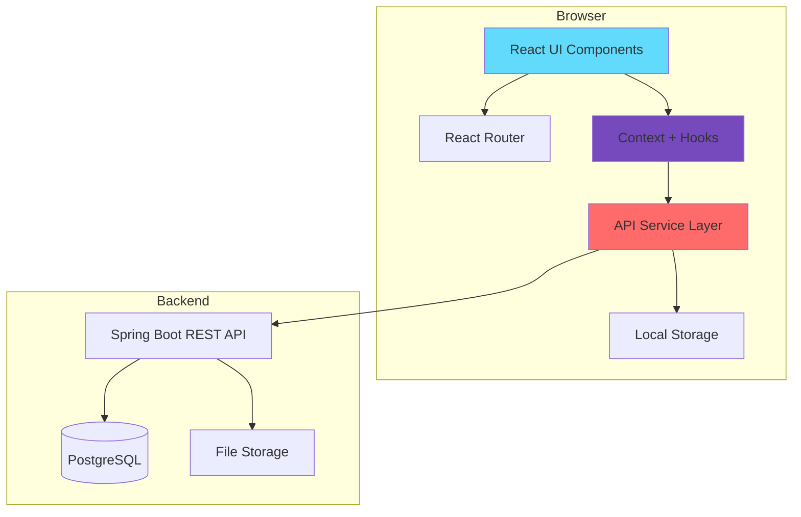
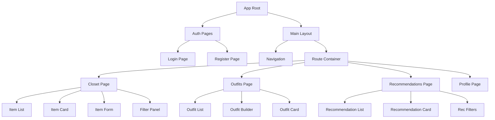
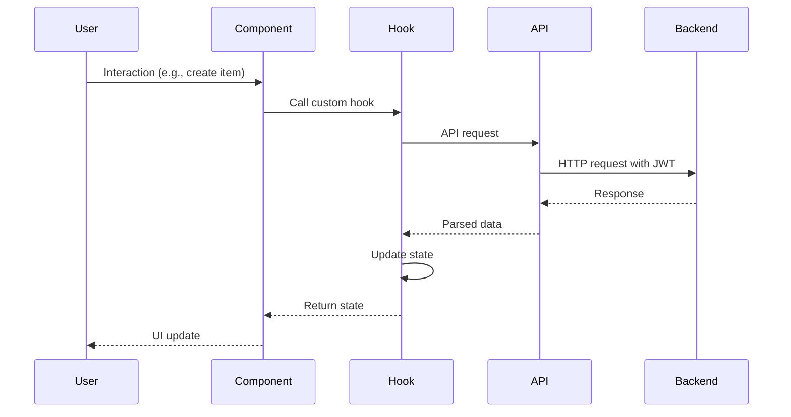
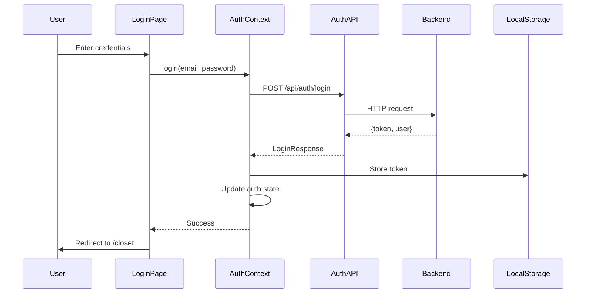
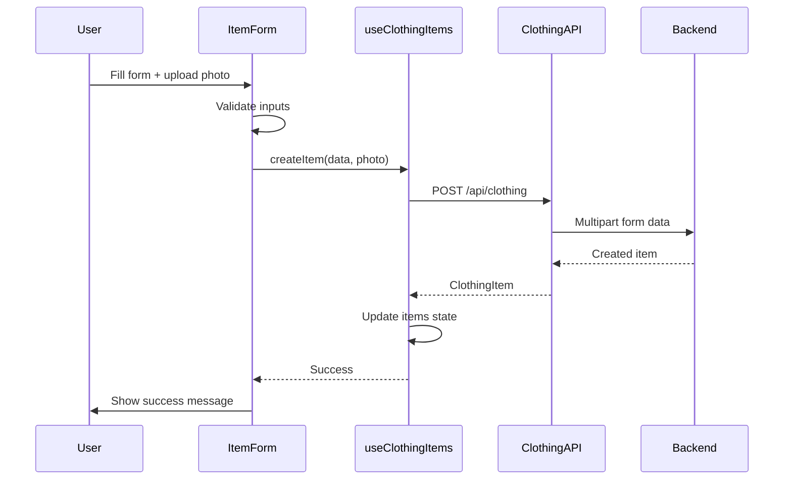
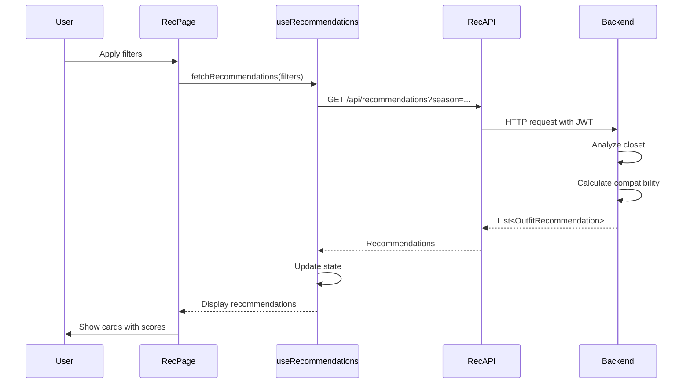

# Design Document: OutfitCreator Frontend

## Overview

The OutfitCreator frontend is a modern, responsive web application built with React and TypeScript that provides a comprehensive digital wardrobe management experience. The application integrates with the OutfitCreator Spring Boot backend REST API to enable users to manage their clothing items, create outfits, and receive intelligent outfit recommendations based on color theory and fit compatibility.

The frontend follows a component-based architecture with clear separation of concerns: presentation components, business logic hooks, API service layer, and state management. The application emphasizes user experience with intuitive navigation, real-time feedback, optimistic updates, and responsive design for mobile and desktop devices.

### Core Capabilities

- User authentication with JWT token management and automatic refresh
- Digital closet management with photo upload, drag-and-drop, and advanced filtering
- Visual outfit builder with drag-and-drop interface
- Intelligent outfit recommendations with visual compatibility scores
- Responsive design supporting mobile, tablet, and desktop viewports
- Offline-first capabilities with service worker caching
- Accessibility compliance (WCAG 2.1 AA)
- Progressive Web App (PWA) features

### Technology Stack

- **Framework**: React 18.x with TypeScript 5.x
- **Build Tool**: Vite 5.x
- **State Management**: React Context API + Custom Hooks
- **Routing**: React Router v6
- **HTTP Client**: Axios with interceptors
- **Form Management**: React Hook Form with Zod validation
- **UI Components**: Custom components with Tailwind CSS
- **Image Handling**: React Dropzone for uploads
- **Testing**: Vitest + React Testing Library
- **E2E Testing**: Playwright
- **Code Quality**: ESLint + Prettier + TypeScript strict mode


## Architecture

### High-Level Architecture



### Component Architecture



### Data Flow Architecture




## Components and Interfaces

### Page Components

#### LoginPage

**Purpose**: User authentication interface

**Interface**:
```typescript
interface LoginPageProps {}

interface LoginFormData {
  email: string;
  password: string;
}
```

**Responsibilities**:
- Render login form with email and password fields
- Validate form inputs
- Handle authentication errors
- Redirect to closet page on successful login
- Provide link to registration page


#### RegisterPage

**Purpose**: New user registration interface

**Interface**:
```typescript
interface RegisterPageProps {}

interface RegisterFormData {
  email: string;
  password: string;
  confirmPassword: string;
  firstName: string;
  lastName: string;
}
```

**Responsibilities**:
- Render registration form
- Validate password strength and confirmation match
- Handle registration errors
- Redirect to login page on successful registration

#### ClosetPage

**Purpose**: Main digital closet management interface

**Interface**:
```typescript
interface ClosetPageProps {}

interface ClosetState {
  items: ClothingItem[];
  filters: ClothingItemFilters;
  pagination: PaginationState;
  isLoading: boolean;
  error: string | null;
}
```

**Responsibilities**:
- Display grid of clothing items with photos
- Provide filtering by category, season, color
- Handle pagination
- Enable item creation, editing, deletion
- Support photo upload with drag-and-drop


#### OutfitsPage

**Purpose**: Outfit creation and management interface

**Interface**:
```typescript
interface OutfitsPageProps {}

interface OutfitsState {
  outfits: Outfit[];
  selectedOutfit: Outfit | null;
  isBuilderOpen: boolean;
  isLoading: boolean;
}
```

**Responsibilities**:
- Display list of saved outfits
- Open outfit builder modal
- Enable outfit editing and deletion
- Show outfit details with item photos

#### RecommendationsPage

**Purpose**: AI-powered outfit recommendation interface

**Interface**:
```typescript
interface RecommendationsPageProps {}

interface RecommendationFilters {
  season?: Season;
  occasion?: string;
  colorPreference?: string;
  limit: number;
}
```

**Responsibilities**:
- Display outfit recommendations with compatibility scores
- Provide filtering options
- Enable saving recommendations as outfits
- Show visual indicators for color and fit compatibility


#### ProfilePage

**Purpose**: User profile management interface

**Interface**:
```typescript
interface ProfilePageProps {}

interface ProfileFormData {
  firstName: string;
  lastName: string;
  email: string;
}
```

**Responsibilities**:
- Display current user information
- Enable profile updates
- Show account statistics (total items, outfits)
- Provide logout functionality

### Feature Components

#### ClothingItemCard

**Purpose**: Display individual clothing item with photo and details

**Interface**:
```typescript
interface ClothingItemCardProps {
  item: ClothingItem;
  onEdit?: (item: ClothingItem) => void;
  onDelete?: (itemId: number) => void;
  onClick?: (item: ClothingItem) => void;
  selectable?: boolean;
  selected?: boolean;
}
```

**Responsibilities**:
- Display item photo with fallback
- Show item name, brand, category
- Display color indicators
- Provide edit and delete actions
- Support selection mode for outfit builder


#### ClothingItemForm

**Purpose**: Form for creating and editing clothing items

**Interface**:
```typescript
interface ClothingItemFormProps {
  item?: ClothingItem;
  onSubmit: (data: ClothingItemFormData, photo?: File) => Promise<void>;
  onCancel: () => void;
  isLoading?: boolean;
}

interface ClothingItemFormData {
  name: string;
  brand?: string;
  primaryColor: string;
  secondaryColor?: string;
  category: ClothingCategory;
  size?: string;
  season?: Season;
  fitCategory?: FitCategory;
  purchaseDate?: string;
}
```

**Responsibilities**:
- Render form fields with validation
- Handle photo upload with preview
- Support drag-and-drop for photos
- Validate file type and size
- Show validation errors
- Handle form submission


#### FilterPanel

**Purpose**: Advanced filtering interface for clothing items

**Interface**:
```typescript
interface FilterPanelProps {
  filters: ClothingItemFilters;
  onFilterChange: (filters: ClothingItemFilters) => void;
  onReset: () => void;
}

interface ClothingItemFilters {
  category?: ClothingCategory;
  season?: Season;
  color?: string;
  searchQuery?: string;
}
```

**Responsibilities**:
- Provide filter controls for category, season, color
- Include search input for text filtering
- Show active filter count
- Enable filter reset
- Apply filters in real-time

#### OutfitBuilder

**Purpose**: Interactive outfit creation interface

**Interface**:
```typescript
interface OutfitBuilderProps {
  isOpen: boolean;
  onClose: () => void;
  onSave: (outfit: OutfitFormData) => Promise<void>;
  editingOutfit?: Outfit;
}

interface OutfitFormData {
  name: string;
  notes?: string;
  items: OutfitItemSelection[];
}

interface OutfitItemSelection {
  clothingItemId: number;
  position: ItemPosition;
}
```

**Responsibilities**:
- Display available clothing items
- Enable drag-and-drop item selection
- Organize items by position (top, bottom, footwear, etc.)
- Show visual preview of outfit
- Validate outfit completeness
- Handle outfit saving


#### OutfitCard

**Purpose**: Display saved outfit with items

**Interface**:
```typescript
interface OutfitCardProps {
  outfit: Outfit;
  onEdit?: (outfit: Outfit) => void;
  onDelete?: (outfitId: number) => void;
  onClick?: (outfit: Outfit) => void;
}
```

**Responsibilities**:
- Display outfit name and notes
- Show item photos in grid layout
- Indicate incomplete outfits
- Provide edit and delete actions
- Show creation date

#### RecommendationCard

**Purpose**: Display outfit recommendation with compatibility scores

**Interface**:
```typescript
interface RecommendationCardProps {
  recommendation: OutfitRecommendation;
  onSave: (recommendation: OutfitRecommendation) => Promise<void>;
}
```

**Responsibilities**:
- Display recommended items with photos
- Show color compatibility score with visual indicator
- Show fit compatibility score with visual indicator
- Display overall score
- Show seasonal appropriateness warning if applicable
- Provide explanation text
- Enable saving as outfit


### Shared Components

#### Navigation

**Purpose**: Main navigation bar

**Interface**:
```typescript
interface NavigationProps {
  user: User | null;
  onLogout: () => void;
}
```

**Responsibilities**:
- Display app logo and title
- Show navigation links (Closet, Outfits, Recommendations, Profile)
- Display user info
- Provide logout button
- Highlight active route

#### Modal

**Purpose**: Reusable modal dialog

**Interface**:
```typescript
interface ModalProps {
  isOpen: boolean;
  onClose: () => void;
  title: string;
  children: React.ReactNode;
  size?: 'sm' | 'md' | 'lg' | 'xl';
}
```

**Responsibilities**:
- Render modal overlay
- Handle close on backdrop click
- Support keyboard navigation (ESC to close)
- Trap focus within modal
- Animate open/close transitions


#### Button

**Purpose**: Reusable button component

**Interface**:
```typescript
interface ButtonProps {
  children: React.ReactNode;
  onClick?: () => void;
  type?: 'button' | 'submit' | 'reset';
  variant?: 'primary' | 'secondary' | 'danger' | 'ghost';
  size?: 'sm' | 'md' | 'lg';
  disabled?: boolean;
  loading?: boolean;
  fullWidth?: boolean;
}
```

#### Input

**Purpose**: Reusable form input component

**Interface**:
```typescript
interface InputProps {
  label: string;
  type?: string;
  value: string;
  onChange: (value: string) => void;
  error?: string;
  placeholder?: string;
  required?: boolean;
  disabled?: boolean;
}
```

#### Select

**Purpose**: Reusable dropdown select component

**Interface**:
```typescript
interface SelectProps {
  label: string;
  value: string;
  onChange: (value: string) => void;
  options: SelectOption[];
  error?: string;
  placeholder?: string;
  required?: boolean;
}

interface SelectOption {
  value: string;
  label: string;
}
```


#### Pagination

**Purpose**: Pagination controls

**Interface**:
```typescript
interface PaginationProps {
  currentPage: number;
  totalPages: number;
  onPageChange: (page: number) => void;
  pageSize: number;
  totalItems: number;
}
```

#### LoadingSpinner

**Purpose**: Loading indicator

**Interface**:
```typescript
interface LoadingSpinnerProps {
  size?: 'sm' | 'md' | 'lg';
  fullScreen?: boolean;
}
```

#### ErrorMessage

**Purpose**: Error display component

**Interface**:
```typescript
interface ErrorMessageProps {
  message: string;
  onRetry?: () => void;
  onDismiss?: () => void;
}
```


## Data Models

### Type Definitions

```typescript
// User types
interface User {
  id: number;
  email: string;
  firstName: string;
  lastName: string;
  createdAt: string;
  updatedAt: string;
}

// Clothing item types
interface ClothingItem {
  id: number;
  name: string;
  brand?: string;
  primaryColor: string;
  secondaryColor?: string;
  category: ClothingCategory;
  size?: string;
  season?: Season;
  fitCategory?: FitCategory;
  purchaseDate?: string;
  photoUrl?: string;
  wearCount: number;
  createdAt: string;
  updatedAt: string;
}

enum ClothingCategory {
  TOP = 'TOP',
  BOTTOM = 'BOTTOM',
  FOOTWEAR = 'FOOTWEAR',
  OUTERWEAR = 'OUTERWEAR',
  ACCESSORIES = 'ACCESSORIES'
}

enum Season {
  SPRING = 'SPRING',
  SUMMER = 'SUMMER',
  AUTUMN = 'AUTUMN',
  WINTER = 'WINTER',
  ALL_SEASON = 'ALL_SEASON'
}

enum FitCategory {
  TIGHT = 'TIGHT',
  REGULAR = 'REGULAR',
  LOOSE = 'LOOSE',
  OVERSIZED = 'OVERSIZED'
}

// Outfit types
interface Outfit {
  id: number;
  name: string;
  notes?: string;
  items: OutfitItem[];
  isComplete: boolean;
  createdAt: string;
  updatedAt: string;
}

interface OutfitItem {
  id: number;
  clothingItem: ClothingItem;
  position: ItemPosition;
}

enum ItemPosition {
  TOP = 'TOP',
  BOTTOM = 'BOTTOM',
  FOOTWEAR = 'FOOTWEAR',
  OUTERWEAR = 'OUTERWEAR',
  ACCESSORY = 'ACCESSORY'
}

// Recommendation types
interface OutfitRecommendation {
  items: ClothingItem[];
  colorCompatibilityScore: number;
  fitCompatibilityScore: number;
  overallScore: number;
  seasonalAppropriateness: 'APPROPRIATE' | 'WARNING' | 'NOT_APPROPRIATE';
  itemPositions: Record<string, string>;
  explanation: string;
}

// API response types
interface ApiResponse<T> {
  data: T;
  message?: string;
}

interface PaginatedResponse<T> {
  content: T[];
  page: number;
  size: number;
  totalElements: number;
  totalPages: number;
}

interface ErrorResponse {
  timestamp: string;
  status: number;
  error: string;
  message: string;
  errorCode: string;
  fieldErrors?: Record<string, string>;
  path?: string;
}

// Auth types
interface LoginRequest {
  email: string;
  password: string;
}

interface LoginResponse {
  token: string;
  user: User;
}

interface RegisterRequest {
  email: string;
  password: string;
  firstName: string;
  lastName: string;
}

// Pagination state
interface PaginationState {
  page: number;
  size: number;
  totalPages: number;
  totalElements: number;
}
```

### Validation Schemas

Using Zod for runtime validation:

```typescript
import { z } from 'zod';

// Login validation
export const loginSchema = z.object({
  email: z.string().email('Invalid email address'),
  password: z.string().min(8, 'Password must be at least 8 characters')
});

// Registration validation
export const registerSchema = z.object({
  email: z.string().email('Invalid email address'),
  password: z.string()
    .min(8, 'Password must be at least 8 characters')
    .regex(/[A-Z]/, 'Password must contain at least one uppercase letter')
    .regex(/[a-z]/, 'Password must contain at least one lowercase letter')
    .regex(/[0-9]/, 'Password must contain at least one number'),
  confirmPassword: z.string(),
  firstName: z.string().min(1, 'First name is required'),
  lastName: z.string().min(1, 'Last name is required')
}).refine(data => data.password === data.confirmPassword, {
  message: 'Passwords do not match',
  path: ['confirmPassword']
});

// Clothing item validation
export const clothingItemSchema = z.object({
  name: z.string().min(1, 'Name is required').max(255),
  brand: z.string().max(100).optional(),
  primaryColor: z.string().min(1, 'Primary color is required'),
  secondaryColor: z.string().optional(),
  category: z.nativeEnum(ClothingCategory),
  size: z.string().optional(),
  season: z.nativeEnum(Season).optional(),
  fitCategory: z.nativeEnum(FitCategory).optional(),
  purchaseDate: z.string().optional()
});

// Outfit validation
export const outfitSchema = z.object({
  name: z.string().min(1, 'Name is required').max(255),
  notes: z.string().max(1000).optional(),
  items: z.array(z.object({
    clothingItemId: z.number(),
    position: z.nativeEnum(ItemPosition)
  })).min(1, 'At least one item is required')
});

// Photo validation
export const photoSchema = z.object({
  file: z.instanceof(File)
    .refine(file => file.size <= 5 * 1024 * 1024, 'File size must be less than 5MB')
    .refine(
      file => ['image/jpeg', 'image/png', 'image/gif'].includes(file.type),
      'Only JPEG, PNG, and GIF files are supported'
    )
});
```


## Main Algorithm/Workflow

### Authentication Flow



### Clothing Item Creation Flow



### Outfit Recommendation Flow




## Core Interfaces/Types

### API Service Layer

```typescript
// Base API client
class ApiClient {
  private baseURL: string;
  private axiosInstance: AxiosInstance;

  constructor(baseURL: string) {
    this.baseURL = baseURL;
    this.axiosInstance = axios.create({
      baseURL,
      headers: {
        'Content-Type': 'application/json'
      }
    });

    this.setupInterceptors();
  }

  private setupInterceptors(): void {
    // Request interceptor: Add JWT token
    this.axiosInstance.interceptors.request.use(
      (config) => {
        const token = localStorage.getItem('authToken');
        if (token) {
          config.headers.Authorization = `Bearer ${token}`;
        }
        return config;
      },
      (error) => Promise.reject(error)
    );

    // Response interceptor: Handle errors
    this.axiosInstance.interceptors.response.use(
      (response) => response,
      (error) => {
        if (error.response?.status === 401) {
          localStorage.removeItem('authToken');
          window.location.href = '/login';
        }
        return Promise.reject(error);
      }
    );
  }

  async get<T>(url: string, params?: any): Promise<T> {
    const response = await this.axiosInstance.get<T>(url, { params });
    return response.data;
  }

  async post<T>(url: string, data?: any): Promise<T> {
    const response = await this.axiosInstance.post<T>(url, data);
    return response.data;
  }

  async put<T>(url: string, data?: any): Promise<T> {
    const response = await this.axiosInstance.put<T>(url, data);
    return response.data;
  }

  async delete<T>(url: string): Promise<T> {
    const response = await this.axiosInstance.delete<T>(url);
    return response.data;
  }

  async postFormData<T>(url: string, formData: FormData): Promise<T> {
    const response = await this.axiosInstance.post<T>(url, formData, {
      headers: {
        'Content-Type': 'multipart/form-data'
      }
    });
    return response.data;
  }
}
```

### Authentication API

```typescript
class AuthAPI {
  constructor(private client: ApiClient) {}

  async login(credentials: LoginRequest): Promise<LoginResponse> {
    return this.client.post<LoginResponse>('/api/auth/login', credentials);
  }

  async register(data: RegisterRequest): Promise<User> {
    return this.client.post<User>('/api/auth/register', data);
  }

  async getProfile(): Promise<User> {
    return this.client.get<User>('/api/auth/profile');
  }

  async updateProfile(data: Partial<User>): Promise<User> {
    return this.client.put<User>('/api/auth/profile', data);
  }
}
```

### Clothing Items API

```typescript
class ClothingItemsAPI {
  constructor(private client: ApiClient) {}

  async getAll(filters?: ClothingItemFilters, page = 0, size = 20): Promise<PaginatedResponse<ClothingItem>> {
    return this.client.get<PaginatedResponse<ClothingItem>>('/api/clothing', {
      ...filters,
      page,
      size
    });
  }

  async getById(id: number): Promise<ClothingItem> {
    return this.client.get<ClothingItem>(`/api/clothing/${id}`);
  }

  async create(data: ClothingItemFormData, photo?: File): Promise<ClothingItem> {
    // If photo is provided, use FormData; otherwise use JSON
    if (photo) {
      const formData = new FormData();
      formData.append('data', JSON.stringify(data));
      formData.append('photo', photo);
      return this.client.postFormData<ClothingItem>('/api/clothing', formData);
    }
    return this.client.post<ClothingItem>('/api/clothing', data);
  }

  async update(id: number, data: ClothingItemFormData): Promise<ClothingItem> {
    return this.client.put<ClothingItem>(`/api/clothing/${id}`, data);
  }

  async delete(id: number): Promise<void> {
    return this.client.delete<void>(`/api/clothing/${id}`);
  }

  async uploadPhoto(id: number, photo: File): Promise<ClothingItem> {
    const formData = new FormData();
    formData.append('photo', photo);
    return this.client.postFormData<ClothingItem>(`/api/clothing/${id}/photo`, formData);
  }
}
```

### Outfits API

```typescript
class OutfitsAPI {
  constructor(private client: ApiClient) {}

  async getAll(page = 0, size = 20): Promise<PaginatedResponse<Outfit>> {
    return this.client.get<PaginatedResponse<Outfit>>('/api/outfits', { page, size });
  }

  async getById(id: number): Promise<Outfit> {
    return this.client.get<Outfit>(`/api/outfits/${id}`);
  }

  async create(data: OutfitFormData): Promise<Outfit> {
    return this.client.post<Outfit>('/api/outfits', data);
  }

  async update(id: number, data: Partial<OutfitFormData>): Promise<Outfit> {
    return this.client.put<Outfit>(`/api/outfits/${id}`, data);
  }

  async delete(id: number): Promise<void> {
    return this.client.delete<void>(`/api/outfits/${id}`);
  }
}
```

### Recommendations API

```typescript
class RecommendationsAPI {
  constructor(private client: ApiClient) {}

  async getRecommendations(filters: RecommendationFilters): Promise<OutfitRecommendation[]> {
    return this.client.get<OutfitRecommendation[]>('/api/recommendations', filters);
  }
}
```


## Key Functions with Formal Specifications

### Custom Hooks

#### useAuth Hook

```typescript
interface UseAuthReturn {
  user: User | null;
  isAuthenticated: boolean;
  isLoading: boolean;
  login: (credentials: LoginRequest) => Promise<void>;
  register: (data: RegisterRequest) => Promise<void>;
  logout: () => void;
  updateProfile: (data: Partial<User>) => Promise<void>;
}

function useAuth(): UseAuthReturn {
  const [user, setUser] = useState<User | null>(null);
  const [isLoading, setIsLoading] = useState(true);

  useEffect(() => {
    // Check for existing token on mount
    const token = localStorage.getItem('authToken');
    if (token) {
      authAPI.getProfile()
        .then(setUser)
        .catch(() => localStorage.removeItem('authToken'))
        .finally(() => setIsLoading(false));
    } else {
      setIsLoading(false);
    }
  }, []);

  const login = async (credentials: LoginRequest) => {
    const response = await authAPI.login(credentials);
    localStorage.setItem('authToken', response.token);
    setUser(response.user);
  };

  const register = async (data: RegisterRequest) => {
    const user = await authAPI.register(data);
    // Auto-login after registration
    await login({ email: data.email, password: data.password });
  };

  const logout = () => {
    localStorage.removeItem('authToken');
    setUser(null);
  };

  const updateProfile = async (data: Partial<User>) => {
    const updatedUser = await authAPI.updateProfile(data);
    setUser(updatedUser);
  };

  return {
    user,
    isAuthenticated: !!user,
    isLoading,
    login,
    register,
    logout,
    updateProfile
  };
}
```

**Preconditions:**
- localStorage is available in the browser
- authAPI is properly initialized with base URL

**Postconditions:**
- After successful login: user is set, token is stored, isAuthenticated is true
- After logout: user is null, token is removed, isAuthenticated is false
- isLoading is false after initial auth check completes

#### useClothingItems Hook

```typescript
interface UseClothingItemsReturn {
  items: ClothingItem[];
  pagination: PaginationState;
  isLoading: boolean;
  error: string | null;
  fetchItems: (filters?: ClothingItemFilters, page?: number) => Promise<void>;
  createItem: (data: ClothingItemFormData, photo?: File) => Promise<ClothingItem>;
  updateItem: (id: number, data: ClothingItemFormData) => Promise<ClothingItem>;
  deleteItem: (id: number) => Promise<void>;
  uploadPhoto: (id: number, photo: File) => Promise<ClothingItem>;
}

function useClothingItems(): UseClothingItemsReturn {
  const [items, setItems] = useState<ClothingItem[]>([]);
  const [pagination, setPagination] = useState<PaginationState>({
    page: 0,
    size: 20,
    totalPages: 0,
    totalElements: 0
  });
  const [isLoading, setIsLoading] = useState(false);
  const [error, setError] = useState<string | null>(null);

  const fetchItems = async (filters?: ClothingItemFilters, page = 0) => {
    setIsLoading(true);
    setError(null);
    try {
      const response = await clothingItemsAPI.getAll(filters, page, pagination.size);
      setItems(response.content);
      setPagination({
        page: response.page,
        size: response.size,
        totalPages: response.totalPages,
        totalElements: response.totalElements
      });
    } catch (err) {
      setError('Failed to fetch clothing items');
      throw err;
    } finally {
      setIsLoading(false);
    }
  };

  const createItem = async (data: ClothingItemFormData, photo?: File) => {
    const newItem = await clothingItemsAPI.create(data, photo);
    setItems(prev => [newItem, ...prev]);
    return newItem;
  };

  const updateItem = async (id: number, data: ClothingItemFormData) => {
    const updatedItem = await clothingItemsAPI.update(id, data);
    setItems(prev => prev.map(item => item.id === id ? updatedItem : item));
    return updatedItem;
  };

  const deleteItem = async (id: number) => {
    await clothingItemsAPI.delete(id);
    setItems(prev => prev.filter(item => item.id !== id));
  };

  const uploadPhoto = async (id: number, photo: File) => {
    const updatedItem = await clothingItemsAPI.uploadPhoto(id, photo);
    setItems(prev => prev.map(item => item.id === id ? updatedItem : item));
    return updatedItem;
  };

  return {
    items,
    pagination,
    isLoading,
    error,
    fetchItems,
    createItem,
    updateItem,
    deleteItem,
    uploadPhoto
  };
}
```

**Preconditions:**
- User is authenticated (JWT token exists)
- clothingItemsAPI is properly initialized

**Postconditions:**
- After fetchItems: items array is populated, pagination state is updated
- After createItem: new item is added to items array
- After updateItem: item in array is updated with new data
- After deleteItem: item is removed from items array
- isLoading is true during operations, false after completion

#### useOutfits Hook

```typescript
interface UseOutfitsReturn {
  outfits: Outfit[];
  pagination: PaginationState;
  isLoading: boolean;
  error: string | null;
  fetchOutfits: (page?: number) => Promise<void>;
  createOutfit: (data: OutfitFormData) => Promise<Outfit>;
  updateOutfit: (id: number, data: Partial<OutfitFormData>) => Promise<Outfit>;
  deleteOutfit: (id: number) => Promise<void>;
}

function useOutfits(): UseOutfitsReturn {
  const [outfits, setOutfits] = useState<Outfit[]>([]);
  const [pagination, setPagination] = useState<PaginationState>({
    page: 0,
    size: 20,
    totalPages: 0,
    totalElements: 0
  });
  const [isLoading, setIsLoading] = useState(false);
  const [error, setError] = useState<string | null>(null);

  const fetchOutfits = async (page = 0) => {
    setIsLoading(true);
    setError(null);
    try {
      const response = await outfitsAPI.getAll(page, pagination.size);
      setOutfits(response.content);
      setPagination({
        page: response.page,
        size: response.size,
        totalPages: response.totalPages,
        totalElements: response.totalElements
      });
    } catch (err) {
      setError('Failed to fetch outfits');
      throw err;
    } finally {
      setIsLoading(false);
    }
  };

  const createOutfit = async (data: OutfitFormData) => {
    const newOutfit = await outfitsAPI.create(data);
    setOutfits(prev => [newOutfit, ...prev]);
    return newOutfit;
  };

  const updateOutfit = async (id: number, data: Partial<OutfitFormData>) => {
    const updatedOutfit = await outfitsAPI.update(id, data);
    setOutfits(prev => prev.map(outfit => outfit.id === id ? updatedOutfit : outfit));
    return updatedOutfit;
  };

  const deleteOutfit = async (id: number) => {
    await outfitsAPI.delete(id);
    setOutfits(prev => prev.filter(outfit => outfit.id !== id));
  };

  return {
    outfits,
    pagination,
    isLoading,
    error,
    fetchOutfits,
    createOutfit,
    updateOutfit,
    deleteOutfit
  };
}
```

**Preconditions:**
- User is authenticated
- outfitsAPI is properly initialized

**Postconditions:**
- After fetchOutfits: outfits array is populated
- After createOutfit: new outfit is added to outfits array
- After updateOutfit: outfit in array is updated
- After deleteOutfit: outfit is removed from outfits array

#### useRecommendations Hook

```typescript
interface UseRecommendationsReturn {
  recommendations: OutfitRecommendation[];
  isLoading: boolean;
  error: string | null;
  fetchRecommendations: (filters: RecommendationFilters) => Promise<void>;
  saveRecommendation: (recommendation: OutfitRecommendation, name: string) => Promise<Outfit>;
}

function useRecommendations(): UseRecommendationsReturn {
  const [recommendations, setRecommendations] = useState<OutfitRecommendation[]>([]);
  const [isLoading, setIsLoading] = useState(false);
  const [error, setError] = useState<string | null>(null);
  const { createOutfit } = useOutfits();

  const fetchRecommendations = async (filters: RecommendationFilters) => {
    setIsLoading(true);
    setError(null);
    try {
      const recs = await recommendationsAPI.getRecommendations(filters);
      setRecommendations(recs);
    } catch (err) {
      setError('Failed to fetch recommendations');
      throw err;
    } finally {
      setIsLoading(false);
    }
  };

  const saveRecommendation = async (recommendation: OutfitRecommendation, name: string) => {
    // Convert recommendation to outfit format
    const outfitData: OutfitFormData = {
      name,
      notes: recommendation.explanation,
      items: recommendation.items.map(item => ({
        clothingItemId: item.id,
        position: recommendation.itemPositions[item.id.toString()] as ItemPosition
      }))
    };
    return createOutfit(outfitData);
  };

  return {
    recommendations,
    isLoading,
    error,
    fetchRecommendations,
    saveRecommendation
  };
}
```

**Preconditions:**
- User is authenticated
- User has clothing items in their closet
- recommendationsAPI is properly initialized

**Postconditions:**
- After fetchRecommendations: recommendations array is populated with scored outfits
- After saveRecommendation: recommendation is converted to outfit and saved
- isLoading is true during fetch, false after completion


## Algorithmic Pseudocode

### Photo Upload with Validation

```typescript
async function handlePhotoUpload(file: File): Promise<string> {
  // Precondition: file is a File object
  
  // Step 1: Validate file type
  const allowedTypes = ['image/jpeg', 'image/png', 'image/gif'];
  if (!allowedTypes.includes(file.type)) {
    throw new Error('Invalid file type. Only JPEG, PNG, and GIF are supported.');
  }
  
  // Step 2: Validate file size (5MB limit)
  const maxSize = 5 * 1024 * 1024;
  if (file.size > maxSize) {
    throw new Error('File size exceeds 5MB limit.');
  }
  
  // Step 3: Create preview URL
  const previewUrl = URL.createObjectURL(file);
  
  // Step 4: Return preview URL for display
  return previewUrl;
  
  // Postcondition: Returns valid preview URL or throws error
}
```

**Preconditions:**
- file parameter is a valid File object
- Browser supports URL.createObjectURL

**Postconditions:**
- Returns preview URL if file is valid
- Throws error with descriptive message if validation fails
- No side effects on file system until actual upload

### Filter Application Algorithm

```typescript
function applyFilters(
  items: ClothingItem[],
  filters: ClothingItemFilters
): ClothingItem[] {
  // Precondition: items is an array of ClothingItem objects
  
  let filteredItems = [...items];
  
  // Step 1: Apply category filter
  if (filters.category) {
    filteredItems = filteredItems.filter(item => item.category === filters.category);
  }
  
  // Step 2: Apply season filter
  if (filters.season) {
    filteredItems = filteredItems.filter(item => 
      item.season === filters.season || item.season === Season.ALL_SEASON
    );
  }
  
  // Step 3: Apply color filter
  if (filters.color) {
    filteredItems = filteredItems.filter(item => 
      item.primaryColor.toLowerCase() === filters.color?.toLowerCase() ||
      item.secondaryColor?.toLowerCase() === filters.color?.toLowerCase()
    );
  }
  
  // Step 4: Apply search query
  if (filters.searchQuery) {
    const query = filters.searchQuery.toLowerCase();
    filteredItems = filteredItems.filter(item =>
      item.name.toLowerCase().includes(query) ||
      item.brand?.toLowerCase().includes(query)
    );
  }
  
  return filteredItems;
  
  // Postcondition: Returns filtered array, original array unchanged
}
```

**Preconditions:**
- items is a valid array of ClothingItem objects
- filters is a valid ClothingItemFilters object

**Postconditions:**
- Returns new array with items matching all active filters
- Original items array is not modified
- Empty array returned if no items match filters
- All returned items satisfy all active filter conditions

**Loop Invariants:**
- Each filter step maintains valid ClothingItem objects
- filteredItems array only contains items that passed previous filters

### Outfit Validation Algorithm

```typescript
function validateOutfit(outfit: OutfitFormData): ValidationResult {
  // Precondition: outfit is an OutfitFormData object
  
  const errors: string[] = [];
  
  // Step 1: Validate name
  if (!outfit.name || outfit.name.trim().length === 0) {
    errors.push('Outfit name is required');
  }
  
  if (outfit.name && outfit.name.length > 255) {
    errors.push('Outfit name must not exceed 255 characters');
  }
  
  // Step 2: Validate items
  if (!outfit.items || outfit.items.length === 0) {
    errors.push('At least one clothing item is required');
  }
  
  // Step 3: Check for duplicate positions
  const positions = outfit.items.map(item => item.position);
  const uniquePositions = new Set(positions);
  if (positions.length !== uniquePositions.size) {
    errors.push('Each position can only have one item');
  }
  
  // Step 4: Validate notes length
  if (outfit.notes && outfit.notes.length > 1000) {
    errors.push('Notes must not exceed 1000 characters');
  }
  
  return {
    isValid: errors.length === 0,
    errors
  };
  
  // Postcondition: Returns validation result with all errors
}

interface ValidationResult {
  isValid: boolean;
  errors: string[];
}
```

**Preconditions:**
- outfit parameter is an OutfitFormData object
- outfit.items is an array (may be empty)

**Postconditions:**
- Returns ValidationResult with isValid true if all checks pass
- Returns all validation errors in errors array
- isValid is false if and only if errors array is non-empty
- No mutations to input outfit object

### Recommendation Score Display Algorithm

```typescript
function getScoreColor(score: number): string {
  // Precondition: score is a number between 0 and 100
  
  if (score >= 85) {
    return 'green'; // Excellent compatibility
  } else if (score >= 70) {
    return 'yellow'; // Good compatibility
  } else if (score >= 50) {
    return 'orange'; // Fair compatibility
  } else {
    return 'red'; // Poor compatibility
  }
  
  // Postcondition: Returns color string based on score threshold
}

function formatScore(score: number): string {
  // Precondition: score is a number
  
  return `${Math.round(score)}%`;
  
  // Postcondition: Returns formatted percentage string
}

function getScoreLabel(score: number): string {
  // Precondition: score is a number between 0 and 100
  
  if (score >= 85) {
    return 'Excellent';
  } else if (score >= 70) {
    return 'Good';
  } else if (score >= 50) {
    return 'Fair';
  } else {
    return 'Poor';
  }
  
  // Postcondition: Returns descriptive label for score
}
```

**Preconditions:**
- score is a valid number
- For getScoreColor and getScoreLabel: score is between 0 and 100 inclusive

**Postconditions:**
- getScoreColor returns one of: 'green', 'yellow', 'orange', 'red'
- formatScore returns string with percentage symbol
- getScoreLabel returns one of: 'Excellent', 'Good', 'Fair', 'Poor'
- No side effects


## Example Usage

### Authentication Example

```typescript
// Login flow
function LoginPage() {
  const { login } = useAuth();
  const navigate = useNavigate();
  const [error, setError] = useState<string | null>(null);

  const handleSubmit = async (data: LoginFormData) => {
    try {
      await login(data);
      navigate('/closet');
    } catch (err) {
      setError('Invalid email or password');
    }
  };

  return (
    <form onSubmit={handleSubmit}>
      <Input label="Email" type="email" required />
      <Input label="Password" type="password" required />
      {error && <ErrorMessage message={error} />}
      <Button type="submit">Login</Button>
    </form>
  );
}
```

### Clothing Item Management Example

```typescript
// Closet page with filtering
function ClosetPage() {
  const { items, pagination, isLoading, fetchItems, deleteItem } = useClothingItems();
  const [filters, setFilters] = useState<ClothingItemFilters>({});
  const [isFormOpen, setIsFormOpen] = useState(false);

  useEffect(() => {
    fetchItems(filters, 0);
  }, [filters]);

  const handleFilterChange = (newFilters: ClothingItemFilters) => {
    setFilters(newFilters);
  };

  const handleDelete = async (id: number) => {
    if (confirm('Are you sure you want to delete this item?')) {
      await deleteItem(id);
    }
  };

  return (
    <div>
      <FilterPanel 
        filters={filters} 
        onFilterChange={handleFilterChange}
        onReset={() => setFilters({})}
      />
      
      <Button onClick={() => setIsFormOpen(true)}>Add Item</Button>
      
      {isLoading ? (
        <LoadingSpinner />
      ) : (
        <div className="grid">
          {items.map(item => (
            <ClothingItemCard
              key={item.id}
              item={item}
              onDelete={handleDelete}
            />
          ))}
        </div>
      )}
      
      <Pagination
        currentPage={pagination.page}
        totalPages={pagination.totalPages}
        onPageChange={(page) => fetchItems(filters, page)}
      />
      
      {isFormOpen && (
        <Modal isOpen={isFormOpen} onClose={() => setIsFormOpen(false)}>
          <ClothingItemForm
            onSubmit={async (data, photo) => {
              await createItem(data, photo);
              setIsFormOpen(false);
            }}
            onCancel={() => setIsFormOpen(false)}
          />
        </Modal>
      )}
    </div>
  );
}
```

### Outfit Builder Example

```typescript
// Outfit builder with drag-and-drop
function OutfitBuilder({ isOpen, onClose, onSave }: OutfitBuilderProps) {
  const { items } = useClothingItems();
  const [selectedItems, setSelectedItems] = useState<OutfitItemSelection[]>([]);
  const [outfitName, setOutfitName] = useState('');

  const handleItemSelect = (item: ClothingItem, position: ItemPosition) => {
    setSelectedItems(prev => {
      // Remove existing item in this position
      const filtered = prev.filter(i => i.position !== position);
      // Add new item
      return [...filtered, { clothingItemId: item.id, position }];
    });
  };

  const handleSave = async () => {
    const validation = validateOutfit({ name: outfitName, items: selectedItems });
    if (!validation.isValid) {
      alert(validation.errors.join('\n'));
      return;
    }
    
    await onSave({ name: outfitName, items: selectedItems });
    onClose();
  };

  return (
    <Modal isOpen={isOpen} onClose={onClose} size="xl">
      <h2>Create Outfit</h2>
      
      <Input
        label="Outfit Name"
        value={outfitName}
        onChange={setOutfitName}
        required
      />
      
      <div className="outfit-positions">
        <PositionSlot
          position={ItemPosition.TOP}
          items={items.filter(i => i.category === ClothingCategory.TOP)}
          selectedItem={selectedItems.find(i => i.position === ItemPosition.TOP)}
          onSelect={(item) => handleItemSelect(item, ItemPosition.TOP)}
        />
        
        <PositionSlot
          position={ItemPosition.BOTTOM}
          items={items.filter(i => i.category === ClothingCategory.BOTTOM)}
          selectedItem={selectedItems.find(i => i.position === ItemPosition.BOTTOM)}
          onSelect={(item) => handleItemSelect(item, ItemPosition.BOTTOM)}
        />
        
        <PositionSlot
          position={ItemPosition.FOOTWEAR}
          items={items.filter(i => i.category === ClothingCategory.FOOTWEAR)}
          selectedItem={selectedItems.find(i => i.position === ItemPosition.FOOTWEAR)}
          onSelect={(item) => handleItemSelect(item, ItemPosition.FOOTWEAR)}
        />
      </div>
      
      <Button onClick={handleSave} disabled={selectedItems.length === 0}>
        Save Outfit
      </Button>
    </Modal>
  );
}
```

### Recommendations Display Example

```typescript
// Recommendations page with filtering
function RecommendationsPage() {
  const { recommendations, isLoading, fetchRecommendations, saveRecommendation } = useRecommendations();
  const [filters, setFilters] = useState<RecommendationFilters>({
    limit: 10
  });

  useEffect(() => {
    fetchRecommendations(filters);
  }, [filters]);

  const handleSave = async (rec: OutfitRecommendation) => {
    const name = prompt('Enter outfit name:');
    if (name) {
      await saveRecommendation(rec, name);
      alert('Outfit saved successfully!');
    }
  };

  return (
    <div>
      <h1>Outfit Recommendations</h1>
      
      <div className="filters">
        <Select
          label="Season"
          value={filters.season || ''}
          onChange={(value) => setFilters({ ...filters, season: value as Season })}
          options={[
            { value: '', label: 'All Seasons' },
            { value: Season.SPRING, label: 'Spring' },
            { value: Season.SUMMER, label: 'Summer' },
            { value: Season.AUTUMN, label: 'Autumn' },
            { value: Season.WINTER, label: 'Winter' }
          ]}
        />
        
        <Input
          label="Color Preference"
          value={filters.colorPreference || ''}
          onChange={(value) => setFilters({ ...filters, colorPreference: value })}
          placeholder="e.g., blue, red"
        />
      </div>
      
      {isLoading ? (
        <LoadingSpinner />
      ) : (
        <div className="recommendations-grid">
          {recommendations.map((rec, index) => (
            <RecommendationCard
              key={index}
              recommendation={rec}
              onSave={handleSave}
            />
          ))}
        </div>
      )}
    </div>
  );
}
```


## Correctness Properties

### Authentication Properties

#### Property 1: Login Round-Trip
For any valid email and password, logging in and then accessing the profile should return the user's information with matching email.

#### Property 2: Token Persistence
For any successful login, the JWT token should be stored in localStorage and automatically included in subsequent API requests.

#### Property 3: Logout Cleanup
For any authenticated user, logging out should remove the token from localStorage and clear the user state.

#### Property 4: Unauthorized Redirect
For any API request that returns 401 Unauthorized, the user should be redirected to the login page and the token should be removed.

### Clothing Item Management Properties

#### Property 5: Item Creation Round-Trip
For any valid clothing item data with photo, creating the item and then fetching the items list should include the newly created item with all attributes matching.

#### Property 6: Photo Upload Validation
For any file that is not JPEG, PNG, or GIF, attempting to upload it should display an error message and prevent submission.

#### Property 7: File Size Validation
For any file larger than 5MB, attempting to upload it should display an error message and prevent submission.

#### Property 8: Item Update Preservation
For any clothing item and any valid attribute updates, updating the item should preserve the item ID and photo URL while changing the specified attributes.

#### Property 9: Item Deletion Removal
For any clothing item, deleting it and then fetching the items list should not include the deleted item.

### Filtering Properties

#### Property 10: Category Filter Correctness
For any category filter value, all displayed items should have that category, and no items with different categories should be displayed.

#### Property 11: Season Filter Correctness
For any season filter value, all displayed items should have that season or ALL_SEASON, and no items with incompatible seasons should be displayed.

#### Property 12: Search Filter Correctness
For any search query, all displayed items should have the query string in their name or brand (case-insensitive).

#### Property 13: Filter Combination
For any combination of active filters, displayed items should satisfy all filter conditions simultaneously.

### Pagination Properties

#### Property 14: Page Size Limit
For any pagination request, the number of items displayed should not exceed the specified page size (default 20).

#### Property 15: Page Navigation
For any page number change, the displayed items should be different from the previous page (unless there are no more items).

### Outfit Management Properties

#### Property 16: Outfit Creation Round-Trip
For any valid outfit with selected items, creating the outfit and then fetching the outfits list should include the newly created outfit with all items in correct positions.

#### Property 17: Outfit Validation
For any outfit creation attempt without a name or without items, the validation should fail and prevent submission.

#### Property 18: Position Uniqueness
For any outfit, each position (TOP, BOTTOM, FOOTWEAR, etc.) should have at most one item.

### Recommendation Properties

#### Property 19: Score Display Consistency
For any recommendation with a score, the displayed color indicator should match the score threshold (green ≥85, yellow ≥70, orange ≥50, red <50).

#### Property 20: Recommendation Save Conversion
For any recommendation saved as an outfit, the created outfit should contain all items from the recommendation in their specified positions.

#### Property 21: Filter Application
For any recommendation filter (season, color preference), all returned recommendations should comply with the specified filters.


## Error Handling

### Error Types and Handling Strategy

#### Network Errors

**Scenario**: API request fails due to network issues

**Response**: 
- Display user-friendly error message
- Provide retry button
- Log error details for debugging

**Example**:
```typescript
try {
  await fetchItems();
} catch (error) {
  if (error.code === 'NETWORK_ERROR') {
    setError('Unable to connect. Please check your internet connection.');
  }
}
```

#### Validation Errors

**Scenario**: User submits invalid form data

**Response**:
- Display field-specific error messages
- Highlight invalid fields
- Prevent form submission
- Keep user input intact

**Example**:
```typescript
const handleSubmit = async (data: ClothingItemFormData) => {
  try {
    clothingItemSchema.parse(data);
    await createItem(data);
  } catch (error) {
    if (error instanceof z.ZodError) {
      error.errors.forEach(err => {
        setFieldError(err.path[0], err.message);
      });
    }
  }
};
```

#### Authentication Errors

**Scenario**: User session expires or token is invalid

**Response**:
- Redirect to login page
- Clear stored token
- Display session expired message
- Preserve intended destination for post-login redirect

**Example**:
```typescript
axios.interceptors.response.use(
  response => response,
  error => {
    if (error.response?.status === 401) {
      localStorage.removeItem('authToken');
      window.location.href = '/login?expired=true';
    }
    return Promise.reject(error);
  }
);
```

#### Resource Not Found Errors

**Scenario**: Requested item or outfit doesn't exist

**Response**:
- Display "not found" message
- Provide navigation back to list view
- Log error for debugging

**Example**:
```typescript
try {
  const item = await getItemById(id);
} catch (error) {
  if (error.response?.status === 404) {
    setError('Item not found. It may have been deleted.');
    navigate('/closet');
  }
}
```

#### Server Errors

**Scenario**: Backend returns 500 Internal Server Error

**Response**:
- Display generic error message (don't expose technical details)
- Provide retry option
- Log full error details
- Consider fallback behavior

**Example**:
```typescript
try {
  await createItem(data);
} catch (error) {
  if (error.response?.status === 500) {
    setError('Something went wrong. Please try again later.');
    console.error('Server error:', error);
  }
}
```

#### File Upload Errors

**Scenario**: Photo upload fails validation or processing

**Response**:
- Display specific error message (file type, size, etc.)
- Clear file input
- Allow user to select different file
- Show validation requirements

**Example**:
```typescript
const handleFileSelect = (file: File) => {
  try {
    photoSchema.parse({ file });
    setPreview(URL.createObjectURL(file));
  } catch (error) {
    if (error instanceof z.ZodError) {
      setError(error.errors[0].message);
      fileInputRef.current.value = '';
    }
  }
};
```

### Global Error Boundary

```typescript
class ErrorBoundary extends React.Component<
  { children: React.ReactNode },
  { hasError: boolean; error: Error | null }
> {
  constructor(props: any) {
    super(props);
    this.state = { hasError: false, error: null };
  }

  static getDerivedStateFromError(error: Error) {
    return { hasError: true, error };
  }

  componentDidCatch(error: Error, errorInfo: React.ErrorInfo) {
    console.error('Error boundary caught:', error, errorInfo);
  }

  render() {
    if (this.state.hasError) {
      return (
        <div className="error-page">
          <h1>Something went wrong</h1>
          <p>We're sorry for the inconvenience. Please refresh the page.</p>
          <Button onClick={() => window.location.reload()}>
            Refresh Page
          </Button>
        </div>
      );
    }

    return this.props.children;
  }
}
```


## Testing Strategy

### Unit Testing Approach

Test individual components, hooks, and utility functions in isolation using Vitest and React Testing Library.

**Key Test Cases**:
- Component rendering with various props
- User interactions (clicks, form submissions)
- Conditional rendering based on state
- Error state handling
- Loading state handling

**Example Unit Test**:
```typescript
import { render, screen, fireEvent } from '@testing-library/react';
import { describe, it, expect, vi } from 'vitest';
import { ClothingItemCard } from './ClothingItemCard';

describe('ClothingItemCard', () => {
  const mockItem: ClothingItem = {
    id: 1,
    name: 'Blue Jeans',
    brand: 'Levi\'s',
    primaryColor: 'blue',
    category: ClothingCategory.BOTTOM,
    wearCount: 5,
    createdAt: '2024-01-01',
    updatedAt: '2024-01-01'
  };

  it('renders item details correctly', () => {
    render(<ClothingItemCard item={mockItem} />);
    
    expect(screen.getByText('Blue Jeans')).toBeInTheDocument();
    expect(screen.getByText('Levi\'s')).toBeInTheDocument();
  });

  it('calls onDelete when delete button is clicked', () => {
    const onDelete = vi.fn();
    render(<ClothingItemCard item={mockItem} onDelete={onDelete} />);
    
    const deleteButton = screen.getByRole('button', { name: /delete/i });
    fireEvent.click(deleteButton);
    
    expect(onDelete).toHaveBeenCalledWith(1);
  });

  it('displays fallback image when photoUrl is missing', () => {
    render(<ClothingItemCard item={mockItem} />);
    
    const img = screen.getByRole('img');
    expect(img).toHaveAttribute('src', expect.stringContaining('placeholder'));
  });
});
```

### Integration Testing Approach

Test interactions between multiple components and API integration using mocked API responses.

**Key Test Cases**:
- Complete user flows (login → create item → view closet)
- API error handling
- State management across components
- Navigation between pages

**Example Integration Test**:
```typescript
import { render, screen, waitFor } from '@testing-library/react';
import { describe, it, expect, vi } from 'vitest';
import { ClosetPage } from './ClosetPage';
import { clothingItemsAPI } from '../api';

vi.mock('../api');

describe('ClosetPage Integration', () => {
  it('fetches and displays clothing items', async () => {
    const mockItems = [
      { id: 1, name: 'Blue Jeans', category: ClothingCategory.BOTTOM },
      { id: 2, name: 'Red Shirt', category: ClothingCategory.TOP }
    ];

    vi.mocked(clothingItemsAPI.getAll).mockResolvedValue({
      content: mockItems,
      page: 0,
      size: 20,
      totalPages: 1,
      totalElements: 2
    });

    render(<ClosetPage />);

    await waitFor(() => {
      expect(screen.getByText('Blue Jeans')).toBeInTheDocument();
      expect(screen.getByText('Red Shirt')).toBeInTheDocument();
    });
  });

  it('handles API errors gracefully', async () => {
    vi.mocked(clothingItemsAPI.getAll).mockRejectedValue(
      new Error('Network error')
    );

    render(<ClosetPage />);

    await waitFor(() => {
      expect(screen.getByText(/failed to fetch/i)).toBeInTheDocument();
    });
  });
});
```

### Property-Based Testing Approach

Use fast-check library to verify universal properties across randomized inputs.

**Property Test Library**: fast-check

**Key Properties to Test**:
- Filter functions always return subsets of input
- Validation functions are consistent
- Score calculations stay within bounds
- State updates maintain invariants

**Example Property-Based Test**:
```typescript
import { describe, it } from 'vitest';
import fc from 'fast-check';
import { applyFilters } from './filters';

describe('Filter Properties', () => {
  // Feature: outfit-creator-frontend, Property 10: Category Filter Correctness
  it('category filter only returns items with matching category', () => {
    fc.assert(
      fc.property(
        fc.array(fc.record({
          id: fc.integer(),
          name: fc.string(),
          category: fc.constantFrom(...Object.values(ClothingCategory)),
          primaryColor: fc.string()
        })),
        fc.constantFrom(...Object.values(ClothingCategory)),
        (items, category) => {
          const filtered = applyFilters(items, { category });
          
          // All returned items must have the specified category
          return filtered.every(item => item.category === category);
        }
      ),
      { numRuns: 100 }
    );
  });

  // Feature: outfit-creator-frontend, Property 13: Filter Combination
  it('combined filters satisfy all conditions', () => {
    fc.assert(
      fc.property(
        fc.array(fc.record({
          id: fc.integer(),
          name: fc.string(),
          category: fc.constantFrom(...Object.values(ClothingCategory)),
          season: fc.constantFrom(...Object.values(Season)),
          primaryColor: fc.string()
        })),
        fc.record({
          category: fc.option(fc.constantFrom(...Object.values(ClothingCategory))),
          season: fc.option(fc.constantFrom(...Object.values(Season))),
          color: fc.option(fc.string())
        }),
        (items, filters) => {
          const filtered = applyFilters(items, filters);
          
          return filtered.every(item => {
            const categoryMatch = !filters.category || item.category === filters.category;
            const seasonMatch = !filters.season || 
              item.season === filters.season || 
              item.season === Season.ALL_SEASON;
            const colorMatch = !filters.color || 
              item.primaryColor.toLowerCase() === filters.color.toLowerCase();
            
            return categoryMatch && seasonMatch && colorMatch;
          });
        }
      ),
      { numRuns: 100 }
    );
  });
});
```

### End-to-End Testing Approach

Use Playwright to test complete user workflows in a real browser environment.

**Key E2E Test Scenarios**:
- User registration and login flow
- Creating clothing items with photo upload
- Building and saving outfits
- Viewing and filtering recommendations
- Profile management

**Example E2E Test**:
```typescript
import { test, expect } from '@playwright/test';

test.describe('Clothing Item Management', () => {
  test.beforeEach(async ({ page }) => {
    // Login before each test
    await page.goto('/login');
    await page.fill('input[name="email"]', 'test@example.com');
    await page.fill('input[name="password"]', 'password123');
    await page.click('button[type="submit"]');
    await expect(page).toHaveURL('/closet');
  });

  test('create new clothing item with photo', async ({ page }) => {
    // Click add item button
    await page.click('button:has-text("Add Item")');
    
    // Fill form
    await page.fill('input[name="name"]', 'Blue Denim Jacket');
    await page.fill('input[name="brand"]', 'Levi\'s');
    await page.selectOption('select[name="category"]', 'OUTERWEAR');
    await page.fill('input[name="primaryColor"]', 'blue');
    
    // Upload photo
    await page.setInputFiles('input[type="file"]', 'test-fixtures/jacket.jpg');
    
    // Submit form
    await page.click('button:has-text("Save")');
    
    // Verify item appears in list
    await expect(page.locator('text=Blue Denim Jacket')).toBeVisible();
  });

  test('filter items by category', async ({ page }) => {
    // Apply category filter
    await page.selectOption('select[name="category"]', 'TOP');
    
    // Wait for filtered results
    await page.waitForTimeout(500);
    
    // Verify only tops are displayed
    const items = await page.locator('[data-testid="clothing-item-card"]').all();
    for (const item of items) {
      const category = await item.getAttribute('data-category');
      expect(category).toBe('TOP');
    }
  });
});
```


## Performance Considerations

### Image Optimization

- Lazy load images using Intersection Observer
- Display thumbnails in list views, full images in detail views
- Implement progressive image loading
- Cache images in browser storage
- Use WebP format when supported

**Implementation**:
```typescript
function LazyImage({ src, alt, thumbnail }: LazyImageProps) {
  const [imageSrc, setImageSrc] = useState(thumbnail);
  const imgRef = useRef<HTMLImageElement>(null);

  useEffect(() => {
    const observer = new IntersectionObserver(
      ([entry]) => {
        if (entry.isIntersecting) {
          setImageSrc(src);
          observer.disconnect();
        }
      },
      { threshold: 0.1 }
    );

    if (imgRef.current) {
      observer.observe(imgRef.current);
    }

    return () => observer.disconnect();
  }, [src]);

  return ;
}
```

### API Request Optimization

- Implement request debouncing for search/filter inputs
- Use pagination to limit data transfer
- Cache API responses with appropriate TTL
- Implement optimistic updates for better UX
- Batch multiple requests when possible

**Debouncing Example**:
```typescript
function useDebounce<T>(value: T, delay: number): T {
  const [debouncedValue, setDebouncedValue] = useState(value);

  useEffect(() => {
    const handler = setTimeout(() => {
      setDebouncedValue(value);
    }, delay);

    return () => clearTimeout(handler);
  }, [value, delay]);

  return debouncedValue;
}

// Usage in search
function SearchInput() {
  const [searchQuery, setSearchQuery] = useState('');
  const debouncedQuery = useDebounce(searchQuery, 300);

  useEffect(() => {
    if (debouncedQuery) {
      fetchItems({ searchQuery: debouncedQuery });
    }
  }, [debouncedQuery]);

  return <input value={searchQuery} onChange={(e) => setSearchQuery(e.target.value)} />;
}
```

### Bundle Size Optimization

- Code splitting by route
- Lazy load non-critical components
- Tree-shake unused dependencies
- Use production builds with minification
- Analyze bundle size with tools

**Route-based Code Splitting**:
```typescript
import { lazy, Suspense } from 'react';

const ClosetPage = lazy(() => import('./pages/ClosetPage'));
const OutfitsPage = lazy(() => import('./pages/OutfitsPage'));
const RecommendationsPage = lazy(() => import('./pages/RecommendationsPage'));

function App() {
  return (
    <Suspense fallback={<LoadingSpinner fullScreen />}>
      <Routes>
        <Route path="/closet" element={<ClosetPage />} />
        <Route path="/outfits" element={<OutfitsPage />} />
        <Route path="/recommendations" element={<RecommendationsPage />} />
      </Routes>
    </Suspense>
  );
}
```

### Rendering Performance

- Use React.memo for expensive components
- Implement virtual scrolling for large lists
- Avoid unnecessary re-renders with proper dependency arrays
- Use production React build
- Profile with React DevTools

**Virtual Scrolling Example**:
```typescript
import { useVirtualizer } from '@tanstack/react-virtual';

function VirtualizedItemList({ items }: { items: ClothingItem[] }) {
  const parentRef = useRef<HTMLDivElement>(null);

  const virtualizer = useVirtualizer({
    count: items.length,
    getScrollElement: () => parentRef.current,
    estimateSize: () => 200,
    overscan: 5
  });

  return (
    <div ref={parentRef} style={{ height: '600px', overflow: 'auto' }}>
      <div style={{ height: `${virtualizer.getTotalSize()}px`, position: 'relative' }}>
        {virtualizer.getVirtualItems().map(virtualItem => (
          <div
            key={virtualItem.key}
            style={{
              position: 'absolute',
              top: 0,
              left: 0,
              width: '100%',
              height: `${virtualItem.size}px`,
              transform: `translateY(${virtualItem.start}px)`
            }}
          >
            <ClothingItemCard item={items[virtualItem.index]} />
          </div>
        ))}
      </div>
    </div>
  );
}
```


## Security Considerations

### JWT Token Management

- Store tokens in localStorage (not cookies to avoid CSRF)
- Implement token expiration handling
- Clear tokens on logout
- Validate token format before use
- Never log tokens

**Token Security**:
```typescript
class TokenManager {
  private static readonly TOKEN_KEY = 'authToken';

  static setToken(token: string): void {
    if (!this.isValidTokenFormat(token)) {
      throw new Error('Invalid token format');
    }
    localStorage.setItem(this.TOKEN_KEY, token);
  }

  static getToken(): string | null {
    return localStorage.getItem(this.TOKEN_KEY);
  }

  static removeToken(): void {
    localStorage.removeItem(this.TOKEN_KEY);
  }

  static isValidTokenFormat(token: string): boolean {
    // JWT format: header.payload.signature
    return /^[A-Za-z0-9-_]+\.[A-Za-z0-9-_]+\.[A-Za-z0-9-_]+$/.test(token);
  }
}
```

### Input Validation and Sanitization

- Validate all user inputs on client side
- Sanitize inputs before display to prevent XSS
- Use Zod schemas for type-safe validation
- Validate file uploads (type, size)
- Escape HTML in user-generated content

**XSS Prevention**:
```typescript
function sanitizeHTML(html: string): string {
  const div = document.createElement('div');
  div.textContent = html;
  return div.innerHTML;
}

// Use in components
function UserNote({ note }: { note: string }) {
  return <div dangerouslySetInnerHTML={{ __html: sanitizeHTML(note) }} />;
}
```

### HTTPS and Secure Communication

- Enforce HTTPS in production
- Use secure WebSocket connections (WSS) if implementing real-time features
- Validate SSL certificates
- Implement Content Security Policy headers

### Sensitive Data Handling

- Never log passwords or tokens
- Clear sensitive form data after submission
- Implement auto-logout after inactivity
- Mask sensitive information in UI

**Auto-logout Implementation**:
```typescript
function useAutoLogout(timeoutMinutes: number = 30) {
  const { logout } = useAuth();
  const timeoutRef = useRef<NodeJS.Timeout>();

  const resetTimeout = useCallback(() => {
    if (timeoutRef.current) {
      clearTimeout(timeoutRef.current);
    }

    timeoutRef.current = setTimeout(() => {
      logout();
      alert('You have been logged out due to inactivity');
    }, timeoutMinutes * 60 * 1000);
  }, [logout, timeoutMinutes]);

  useEffect(() => {
    const events = ['mousedown', 'keydown', 'scroll', 'touchstart'];
    
    events.forEach(event => {
      document.addEventListener(event, resetTimeout);
    });

    resetTimeout();

    return () => {
      events.forEach(event => {
        document.removeEventListener(event, resetTimeout);
      });
      if (timeoutRef.current) {
        clearTimeout(timeoutRef.current);
      }
    };
  }, [resetTimeout]);
}
```


## Dependencies

### Core Dependencies

```json
{
  "dependencies": {
    "react": "^18.2.0",
    "react-dom": "^18.2.0",
    "react-router-dom": "^6.20.0",
    "axios": "^1.6.0",
    "zod": "^3.22.0",
    "react-hook-form": "^7.48.0",
    "@hookform/resolvers": "^3.3.0",
    "react-dropzone": "^14.2.0"
  },
  "devDependencies": {
    "@types/react": "^18.2.0",
    "@types/react-dom": "^18.2.0",
    "typescript": "^5.3.0",
    "vite": "^5.0.0",
    "@vitejs/plugin-react": "^4.2.0",
    "vitest": "^1.0.0",
    "@testing-library/react": "^14.1.0",
    "@testing-library/user-event": "^14.5.0",
    "@playwright/test": "^1.40.0",
    "fast-check": "^3.15.0",
    "tailwindcss": "^3.4.0",
    "autoprefixer": "^10.4.0",
    "postcss": "^8.4.0",
    "eslint": "^8.55.0",
    "prettier": "^3.1.0"
  }
}
```

### External Services

- **Backend API**: OutfitCreator Spring Boot REST API
  - Base URL: Configurable via environment variable
  - Authentication: JWT Bearer tokens
  - Endpoints: /api/auth, /api/clothing, /api/outfits, /api/recommendations

### Browser Requirements

- Modern browsers with ES6+ support
- Chrome 90+, Firefox 88+, Safari 14+, Edge 90+
- JavaScript enabled
- LocalStorage support
- File API support for photo uploads


## Deployment Configuration

### Environment Variables

```bash
# .env.production
VITE_API_BASE_URL=https://api.outfitcreator.com
VITE_APP_NAME=OutfitCreator
VITE_MAX_FILE_SIZE=5242880
VITE_SUPPORTED_IMAGE_TYPES=image/jpeg,image/png,image/gif
```

### Build Configuration

```typescript
// vite.config.ts
import { defineConfig } from 'vite';
import react from '@vitejs/plugin-react';

export default defineConfig({
  plugins: [react()],
  build: {
    outDir: 'dist',
    sourcemap: false,
    minify: 'terser',
    rollupOptions: {
      output: {
        manualChunks: {
          'react-vendor': ['react', 'react-dom', 'react-router-dom'],
          'form-vendor': ['react-hook-form', 'zod'],
          'api-vendor': ['axios']
        }
      }
    }
  },
  server: {
    port: 3000,
    proxy: {
      '/api': {
        target: 'http://localhost:8080',
        changeOrigin: true
      }
    }
  }
});
```

### Deployment Steps

1. Build production bundle: `npm run build`
2. Test production build locally: `npm run preview`
3. Deploy `dist` folder to static hosting (Netlify, Vercel, S3 + CloudFront)
4. Configure environment variables in hosting platform
5. Set up custom domain and SSL certificate
6. Configure CORS on backend to allow frontend domain
